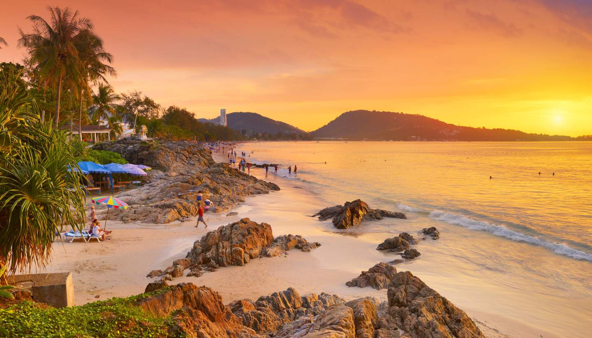

안다만 해에 자리잡은 열대 낙원 푸켓에 오신 것을 환영합니다. 멋진 해변, 활기찬 문화, 신나는 밤문화가 있는 푸켓은 모두를 위한 무언가를 가지고 있습니다. 푸켓을 진정으로 특별하게 만드는 다섯 가지 주요 하이라이트를 살펴보겠습니다.

## 1. 풍부한 해변
푸켓은 세계에서 가장 아름다운 해변을 자랑합니다. 활기찬 분위기와 수상 스포츠로 유명한 유명한 파통 비치부터 수정처럼 맑은 바다가 있는 고요한 카타 노이 비치까지 해변을 사랑하는 사람들은 천국에 있을 것입니다.

## 2. 문화적 보석
푸켓의 풍부한 문화유산에 흠뻑 빠져보세요. 상징적인 빅 부다를 방문하고 매력적인 중국-포르투갈 건축물이 있는 유서 깊은 구시가지를 탐험하고 활기찬 행렬과 의식으로 가득 찬 연례 푸켓 채식 축제를 목격하세요.

## 3. 아일랜드 호핑 어드벤처
푸켓은 인근 섬을 탐험할 수 있는 완벽한 관문입니다. 피피섬으로 보트 투어를 떠나 멋진 석회암 절벽과 청록색 바다를 감상하세요. 영화 '황금총을 가진 사나이'에 등장했던 독특한 제임스 본드 섬도 놓치지 마세요.

## 4. 군침 도는 요리
푸켓 요리의 감질나는 맛에 빠져보세요. 현지 시장에서 맛있는 해산물 요리를 맛보고, 시그니처 푸켓 스타일 카레를 맛보고, 상쾌한 코코넛 아이스크림을 맛보세요. 푸켓의 음식 현장은 더 많은 것을 갈망하게 만들 것입니다.

## 5. 번창하는 나이트라이프
전에 없던 푸켓의 활기찬 나이트라이프를 경험해 보세요. 해변가 바를 즐기거나 세계적인 수준의 클럽에서 밤새도록 춤을 추거나 활기찬 야시장을 둘러보세요. 푸켓의 밤문화는 파티 애호가와 밤 올빼미를 위한 다양한 엔터테인먼트 옵션을 제공합니다.

푸켓은 진정으로 안다만해의 진주라는 명성에 걸맞게 살고 있습니다. 숨이 멎을 듯한 자연의 아름다움, 풍부한 문화, 흥미진진한 명소가 있는 이 열대 낙원이 꼭 방문해야 할 목적지라는 것은 놀라운 일이 아닙니다. 푸켓 여행을 계획하고 잊을 수 없는 추억을 만드세요.

