나트랑은 깨끗한 해변과 활기찬 해양 생물로 유명한 베트남의 아름다운 해안 도시입니다. 나트랑에 대해 꼭 알아야 할 5가지 사항을 살펴보겠습니다.

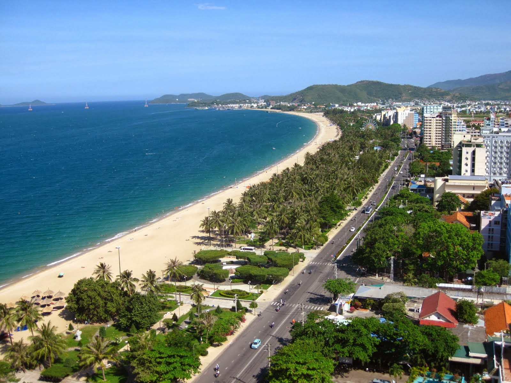

## 1. 멋진 해변
나트랑은 수정처럼 맑은 바닷물과 백사장이 있는 멋진 해변으로 유명합니다. 일부 인기 있는 해변으로는 Nha Trang Beach, Bai Dai Beach 및 Hon Chong Beach가 있습니다. 휴식을 원하든 수상 스포츠를 원하든 나트랑의 해변에는 모두를 위한 무언가가 있습니다.

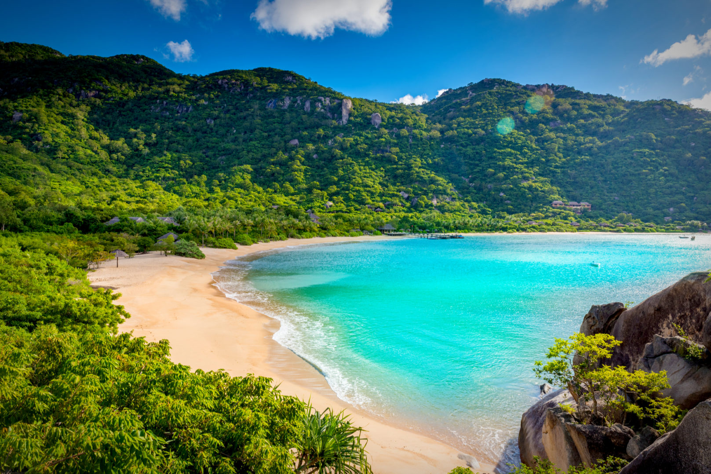
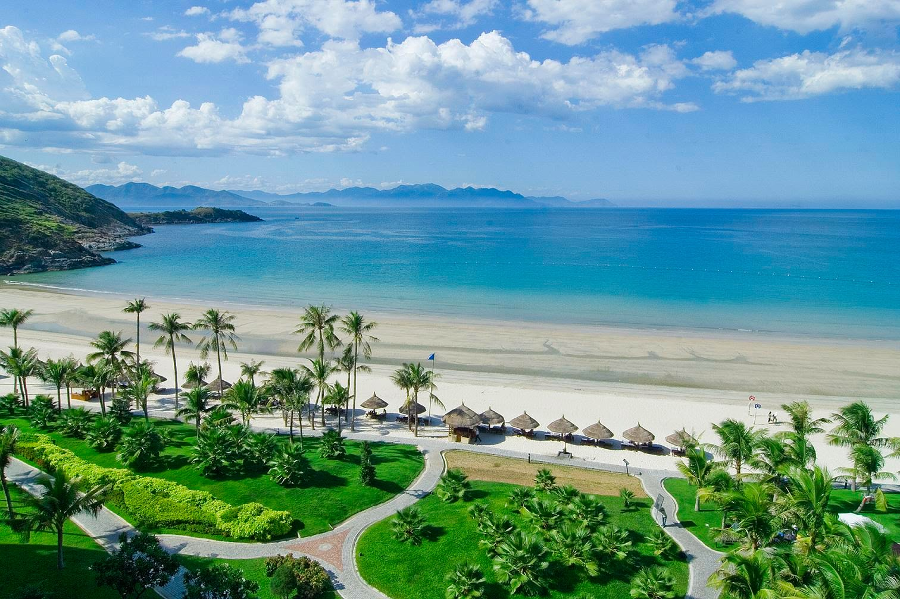

## 2. 풍부한 해양 생물
나트랑은 다이빙과 스노클링 애호가들의 천국입니다. 이 도시는 활기찬 산호초와 다양한 해양 생물의 서식지입니다. Hon Mun Marine Protected Area 및 Hon Tam Island와 같은 사이트에서 수중 경이로움을 탐험할 수 있습니다. 아름다운 해양 생물들과 함께 수영할 수 있는 기회를 놓치지 마세요.

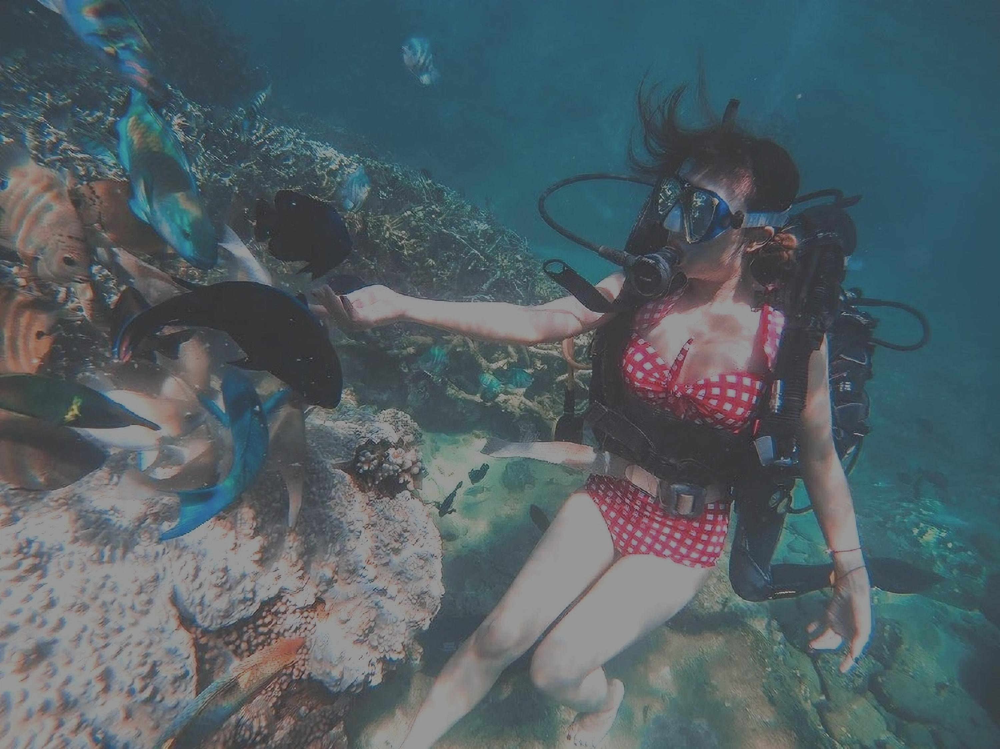
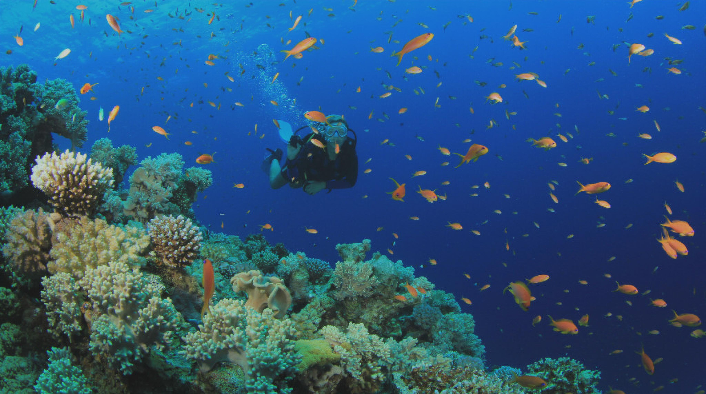

## 3. 맛있는 해산물
나트랑은 군침 도는 해산물 요리로 유명합니다. 갓 잡은 생선부터 탱탱한 새우까지 다양한 해산물 요리를 맛보실 수 있습니다. 구운 가리비, 생선 전골, 새우 춘권과 같은 특선 요리를 맛보는 것을 잊지 마십시오. 당신의 미뢰가 당신에게 감사할 것입니다!

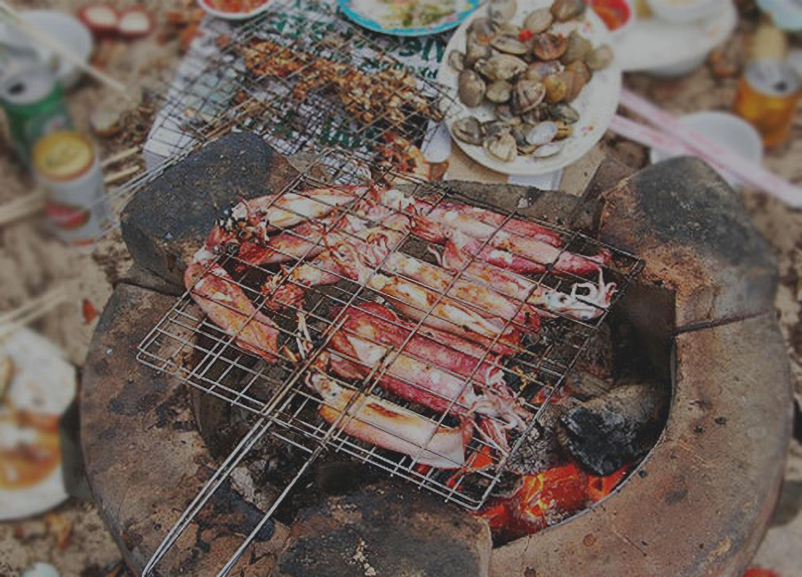
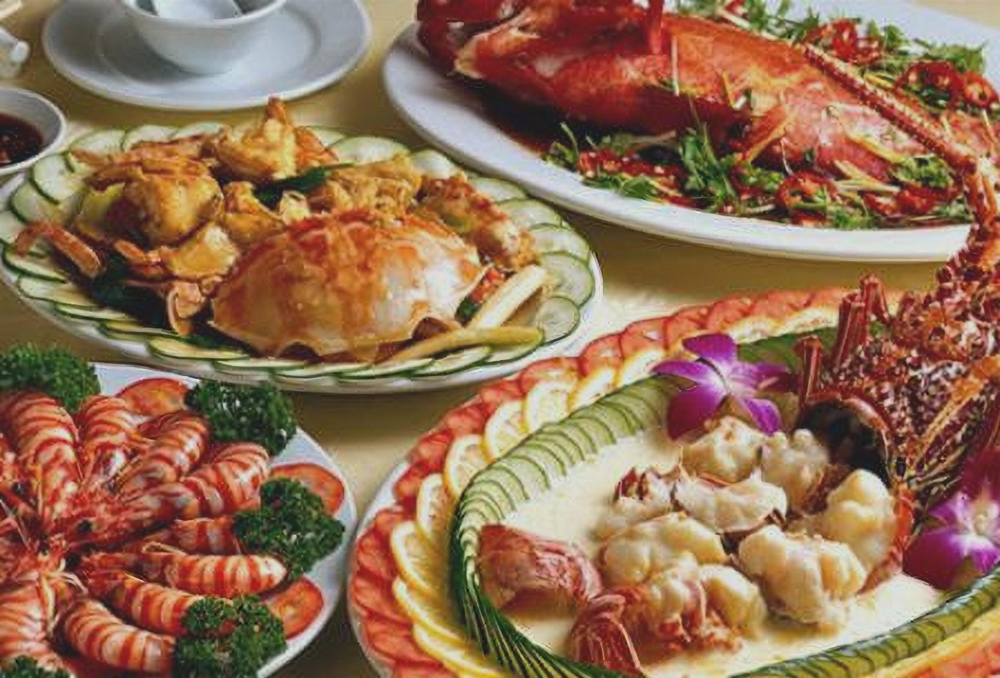

## 4. 빈펄랜드
Vinpearl Land는 Nha Trang에 위치한 인기있는 놀이 공원입니다. 스릴 넘치는 놀이기구, 워터파크, 탁 트인 전망의 케이블카 등 다양한 어트랙션을 제공합니다. 가족 친화적인 엔터테인먼트와 아드레날린이 솟구치는 모험을 즐기기에 완벽한 장소입니다.

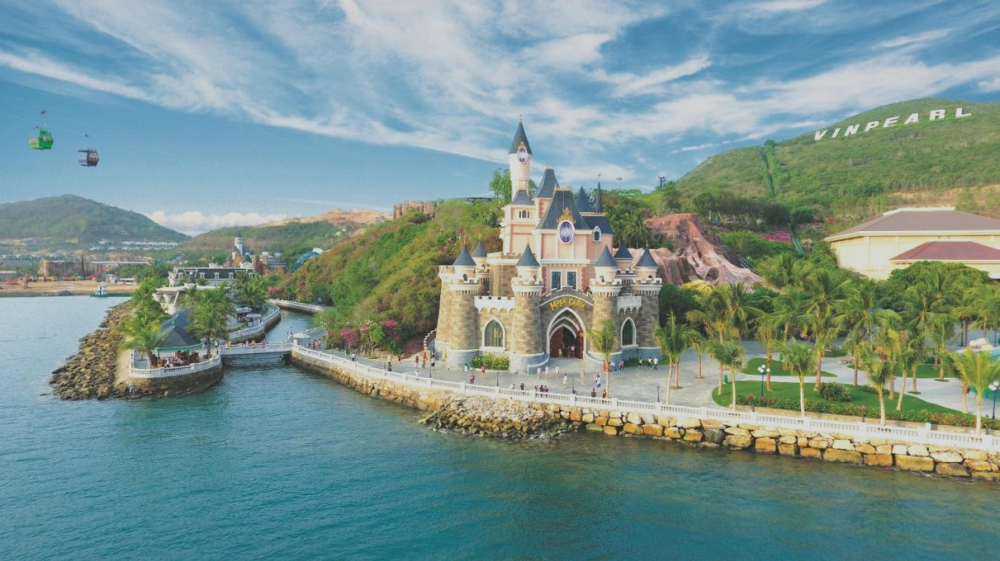
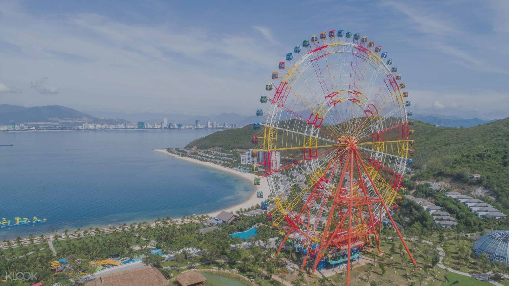

## 5. 포 나가르 참 타워
Po Nagar Cham Towers는 나트랑에서 꼭 방문해야 할 유적지입니다. 이 고대 힌두 사원은 7세기로 거슬러 올라가며 놀라운 건축학적 세부 사항을 보여줍니다. 타워는 지역의 풍부한 문화 및 종교 유산을 엿볼 수 있게 해줍니다.

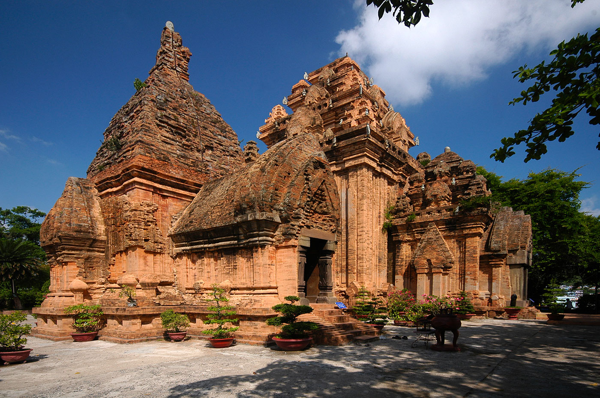
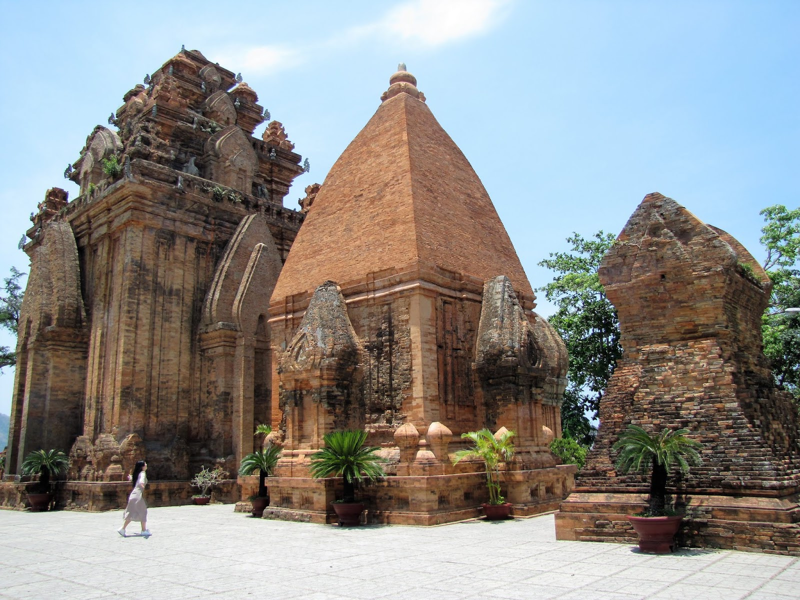

Nha Trang은 자연의 아름다움, 스릴 넘치는 활동 및 문화 유산이 완벽하게 조화를 이루는 매혹적인 여행지입니다. 휴식, 모험 또는 미식의 즐거움을 원하든 나트랑에는 모든 것이 있습니다. 이 해안 보석의 경이로움을 경험하기 위해 방문을 계획하십시오.

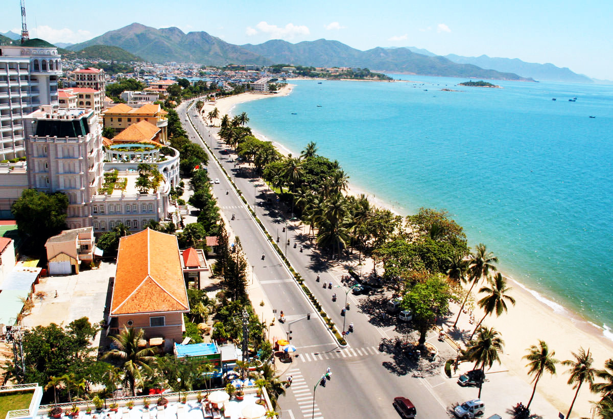
