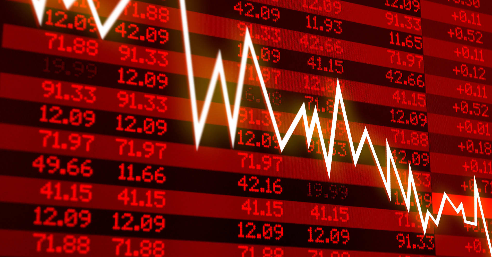
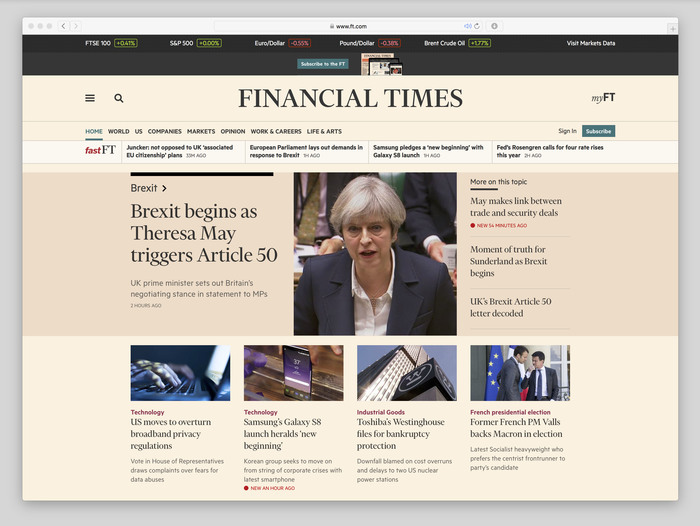
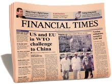
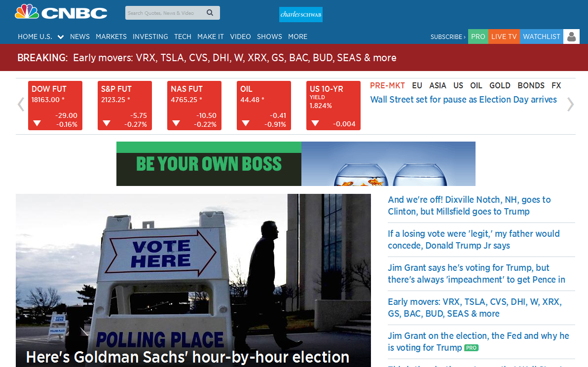
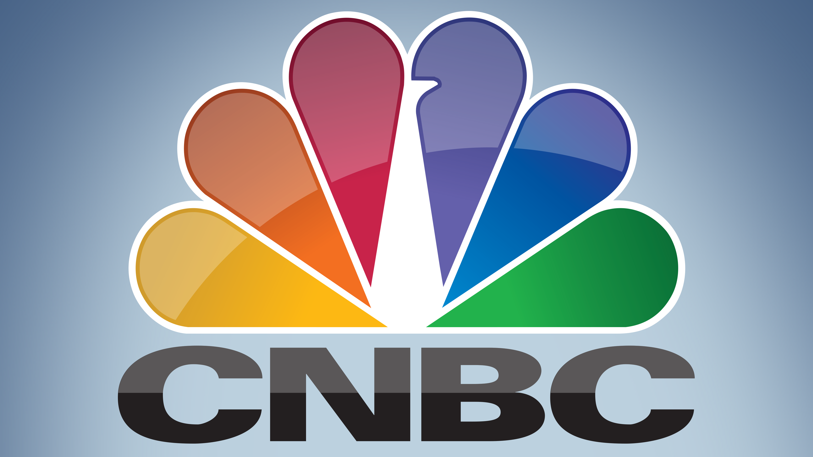
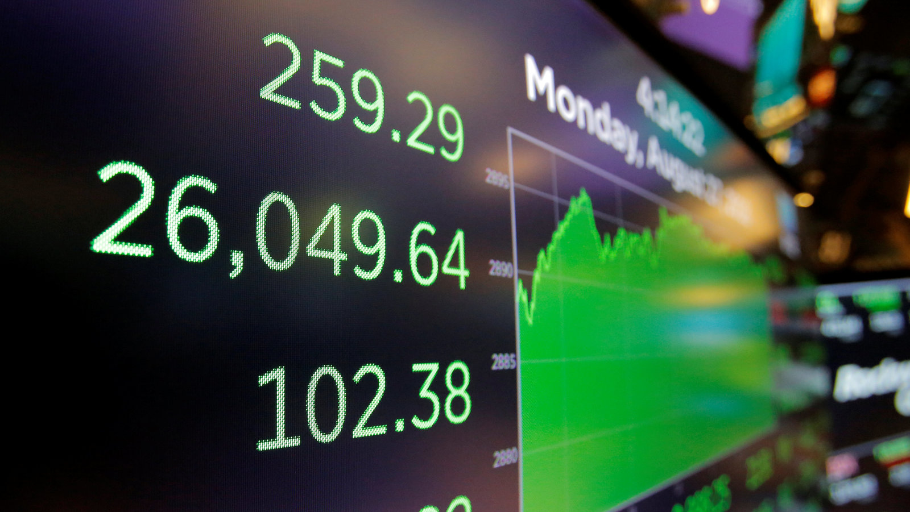

In today's fast-paced world, staying updated with the latest economy news is crucial for making informed decisions. Here are three of the best economy news websites that you should definitely check out:

## Website 1: Financial Times
Financial Times is renowned for its in-depth coverage of global business, finance, and economics. It provides comprehensive analysis, market insights, and expert opinions. Whether you're interested in stock markets, economic policies, or corporate news, Financial Times has got you covered.

## Website 2: Bloomberg
Bloomberg is a leading source of real-time financial information. It offers breaking news, market data, and analysis on various economic sectors. With its user-friendly interface and reliable reporting, you can easily stay updated on the latest market trends and economic developments.

## Website 3: CNBC
CNBC is a popular choice for business and finance news. It provides live market updates, expert interviews, and in-depth analysis of global economic events. From stock market movements to economic indicators, CNBC delivers reliable information to help you make informed financial decisions.

These three economy news websites offer valuable insights into the world of finance and economics. Whether you're a business professional, investor, or simply interested in the subject, these websites are must-visits for staying informed.

