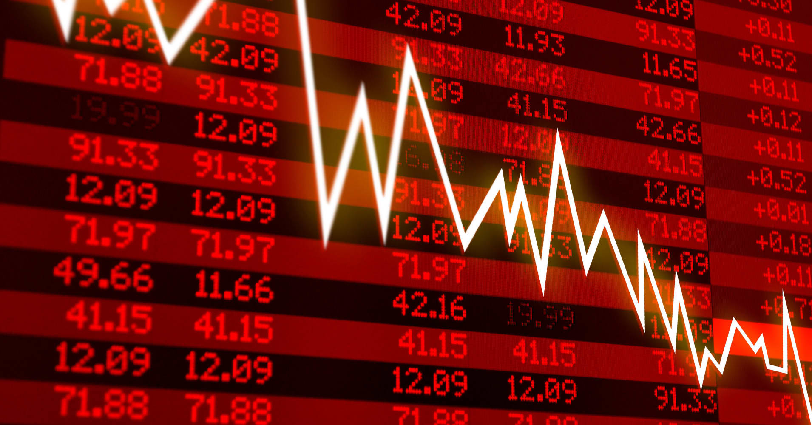
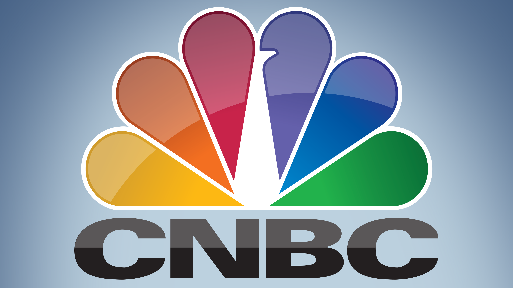
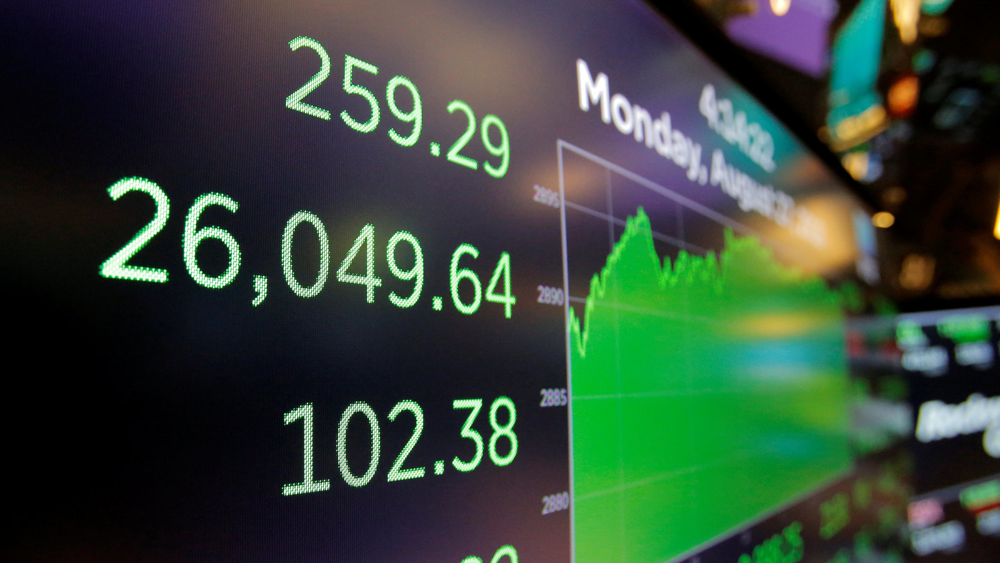

오늘날과 같이 급변하는 세상에서 정보에 입각한 결정을 내리려면 최신 경제 뉴스를 최신 상태로 유지하는 것이 중요합니다. 꼭 확인해야 할 최고의 경제 뉴스 웹사이트 세 곳을 소개합니다.

## 웹사이트 1: 파이낸셜 타임즈
Financial Times는 글로벌 비즈니스, 금융 및 경제에 대한 심도 있는 보도로 유명합니다. 포괄적인 분석, 시장 통찰력 및 전문가 의견을 제공합니다. 주식 시장, 경제 정책 또는 기업 뉴스에 관심이 있다면 파이낸셜 타임즈가 도와드리겠습니다.

## 웹사이트 2: 블룸버그
Bloomberg는 실시간 금융 정보의 선도적인 출처입니다. 속보, 시장 데이터 및 다양한 경제 부문에 대한 분석을 제공합니다. 사용자 친화적인 인터페이스와 신뢰할 수 있는 보고를 통해 최신 시장 동향 및 경제 발전에 대한 최신 정보를 쉽게 얻을 수 있습니다.

## 웹사이트 3: CNBC
CNBC는 비즈니스 및 금융 뉴스에서 인기 있는 선택입니다. 라이브 시장 업데이트, 전문가 인터뷰 및 글로벌 경제 이벤트에 대한 심층 분석을 제공합니다. 주식 시장 움직임에서 경제 지표에 이르기까지 CNBC는 정보에 입각한 재무 결정을 내리는 데 도움이 되는 신뢰할 수 있는 정보를 제공합니다.

이 세 가지 경제 뉴스 웹사이트는 금융 및 경제 세계에 대한 귀중한 통찰력을 제공합니다. 귀하가 비즈니스 전문가이든, 투자자이든, 단순히 해당 주제에 관심이 있든 관계없이 이 웹사이트는 최신 정보를 얻기 위해 꼭 방문해야 할 곳입니다.

