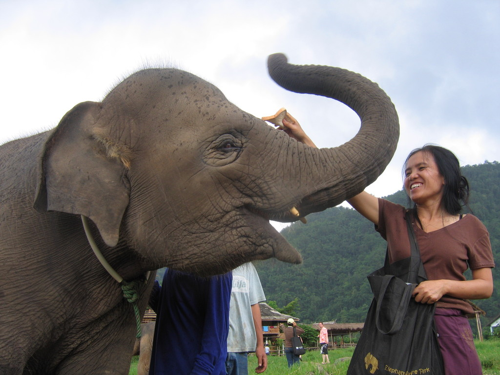
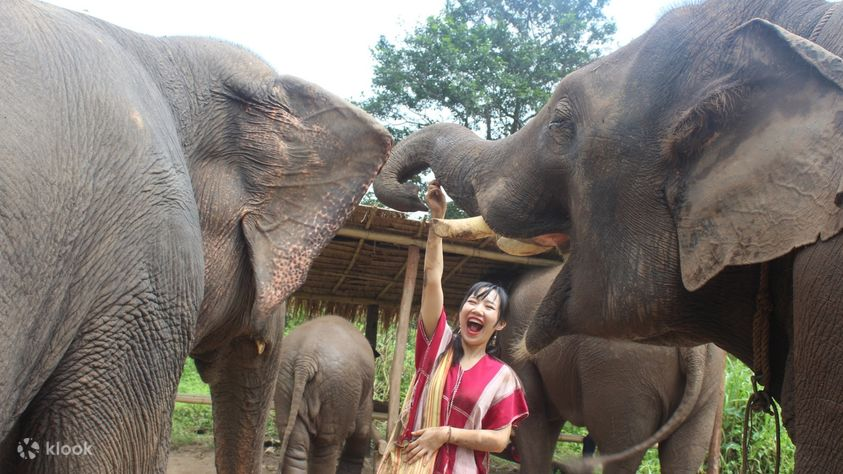

태국은 아름다운 해변, 풍부한 문화와 역사, 맛있는 음식, 그리고 다양한 경험을 즐길 수 있는 매혹적인 여행지입니다. 태국 여행을 떠나기 전에 알아야 할 세 가지 꼭 필요한 정보를 알아보겠습니다!

## 1. 태국의 다양한 볼거리
태국은 다양성으로 가득 찬 나라입니다. 화려한 방콕의 도시 경관, 폭풍우처럼 아름다운 푸켓의 해변, 치앙마이의 신비로운 정글까지 각 지역마다 독특한 경험을 제공합니다. 태국 사람들의 문화적인 풍요롭음, 입맛 돋우는 음식, 그리고 따뜻한 환대를 느껴보세요.

## 2. 태국 현지 전통
태국을 진정으로 경험하기 위해 현지 전통에 몰입해보세요. 떠다니는 시장을 방문해 배 위에서 과일과 채소를 판매하는 장사들을 만나보세요. 전통 태국 무용 공연을 관람하거나 태국 요리 수업에 도전해보세요. 현지 문화에 몸을 담그는 것은 여행을 더욱 풍요롭게 만들어줄 것입니다.

## 3. 태국에서의 책임 있는 관광
태국의 멋진 야생 동물을 마주할 때, 윤리적인 경험을 선택하세요. 코끼리 보호소를 지원하며 이 상냥한 거인들의 복지를 최우선으로 생각해주세요. 자연과 현지 관습을 존중하는 책임 있는 관광에 참여해보세요. 우리 함께 이 놀라운 나라의 아름다움을 보존할 수 있습니다.

기억해주세요, 이것들은 태국이 제공하는 놀라운 즐거움의 일부에 불과합니다. 여행 일정을 계획하고, 다양성을 받아들이고, 현지 전통에 몰입하며, 책임 있는 관광을 실천해보세요. 태국의 마법 같은 아름다움을 발견해보세요.

