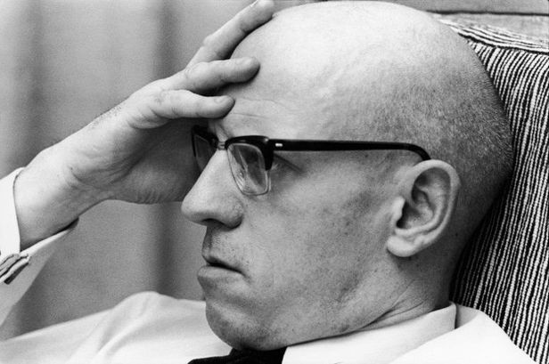

[철학자][topic]는 인간 존재의 근본적인 질문에 대한 통찰력을 제공하며,
생각의 깊이와 철학적 사고력을 향상시켜 더 나은 삶과 사회를 탐구할 수 있게 합니다.

우리가 꼭 알아야 할 세 명의 중요한 [철학자][topic]에 대해 이야기하려고 합니다.

## 1. 마르틴 [하이데거][main1]

[하이데거][main1]는 20세기의 유명한 [철학자][topic]로, 존재주의에 대한 연구로 유명합니다.
그는 우리 인간의 존재의미와 의식의 복잡성을 탐구하였으며,
인간이 직면한 윤리적인 문제에 대한 해법을 제시했습니다.
이를 통해 우리는 당면한 삶의 의문에 대해 생각해 볼 수 있습니다.

## 2. [소크라테스][main2]

[소크라테스][main2]는 고대 그리스의 유명한 [철학자][topic]로, 소크라티스적 방법론과
함께 인류의 형성 및 지식 탐구에 큰 영향력을 끼쳤습니다.
그의 철학적 개념은 아직도 현대 사회에서 많은 영감을 주고 있으며,
그의 미학적 가치와 윤리적 원칙은 저희 삶을 더욱 의미있게 만들어 줄 수 있습니다.

## 3. [미셸 푸코][main3]

[미셸 푸코][main3]는 현대 프랑스의 [철학자][topic]이자 사회학자로, 조세펀 이론과 바오더리아드 사상으로 유명합니다. 그는 권력과 지식, 성과 사람의 관계에 대한 비판적인 시각을 제시했습니다. 그의 작품을 공부함으로써 우리는 정치, 사회 및 개인의 역할에 대해 독자적인 생각을 발전시킬 수 있습니다.

## 결론

이들의 철학적인 견해와 이론이 우리가 삶을 살아가는 데 어떠한 영감을 줄 수 있는지, 한번 고민해 보시는 건 어떨까요? 저희는 지식과 이해의 공유로 즐거운 여정을 함께 하기를 바랍니다.

[topic]: https://www.google.com/search?q=철학자
[main1]: https://www.google.com/search?q=하이데거
[main2]: https://www.google.com/search?q=소크라테스
[main3]: https://www.google.com/search?q=미셸푸코