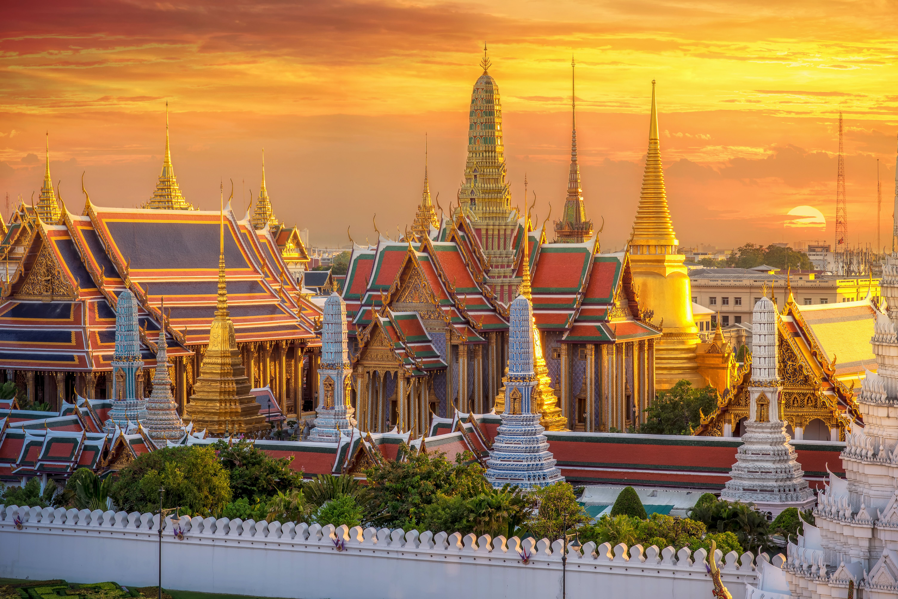
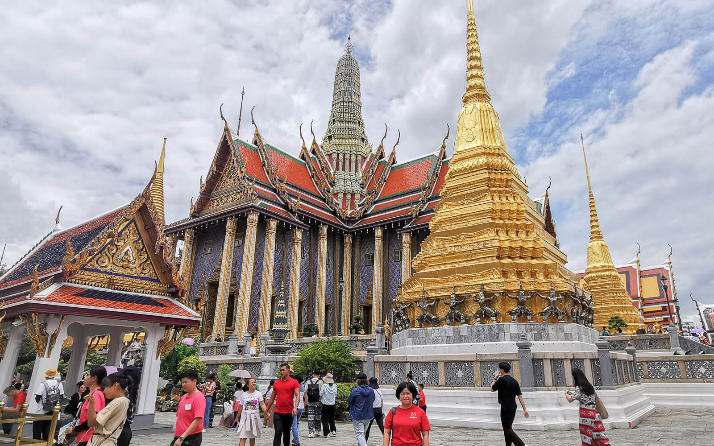
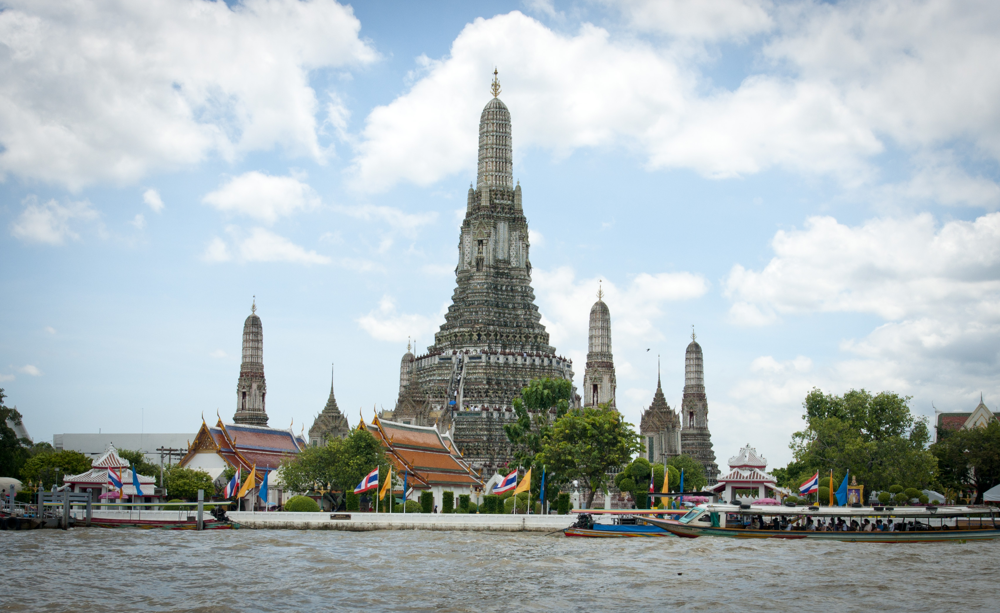
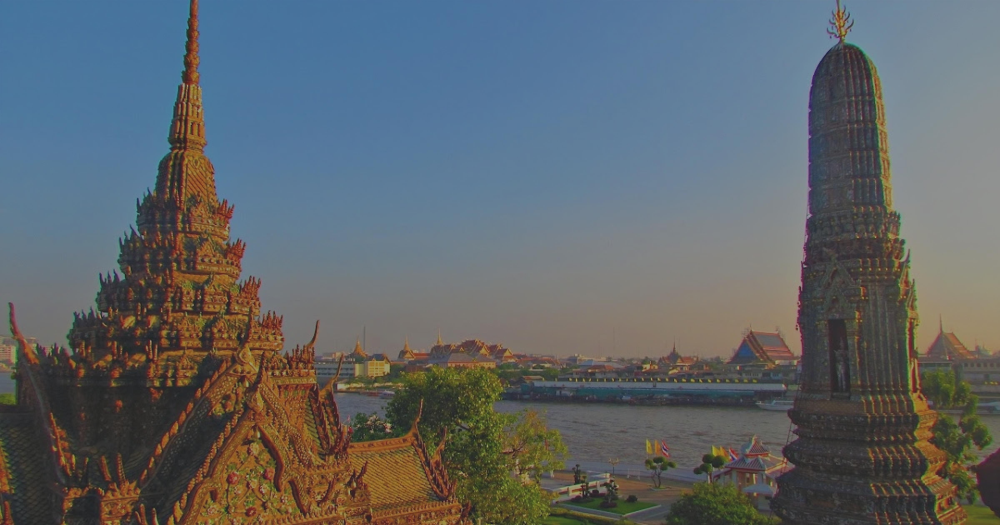
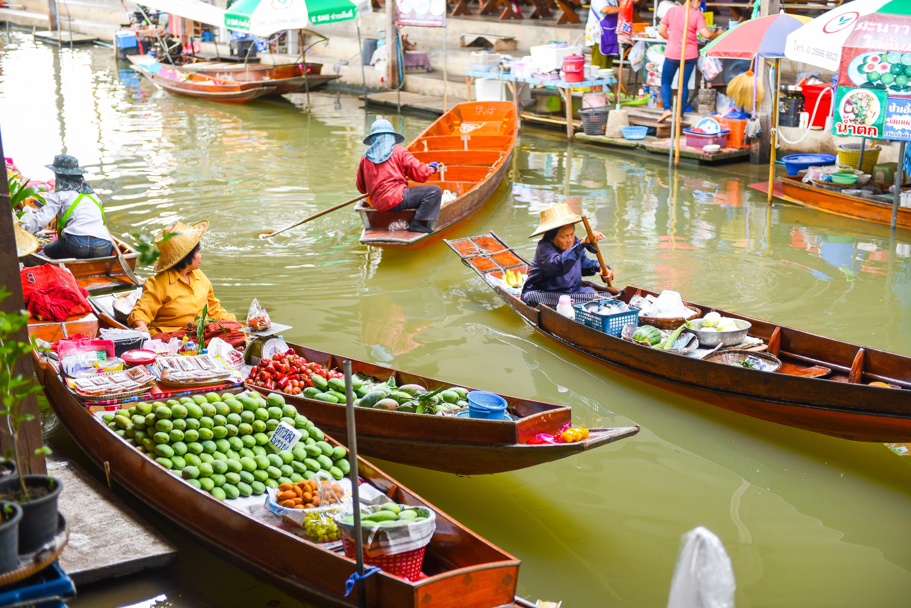
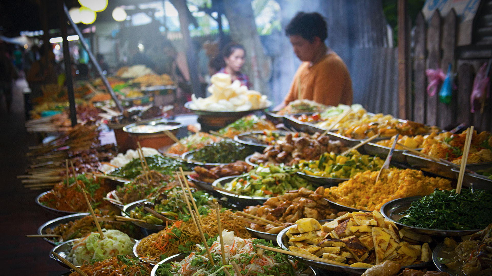
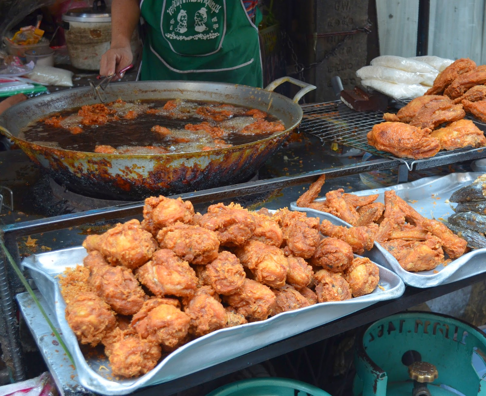
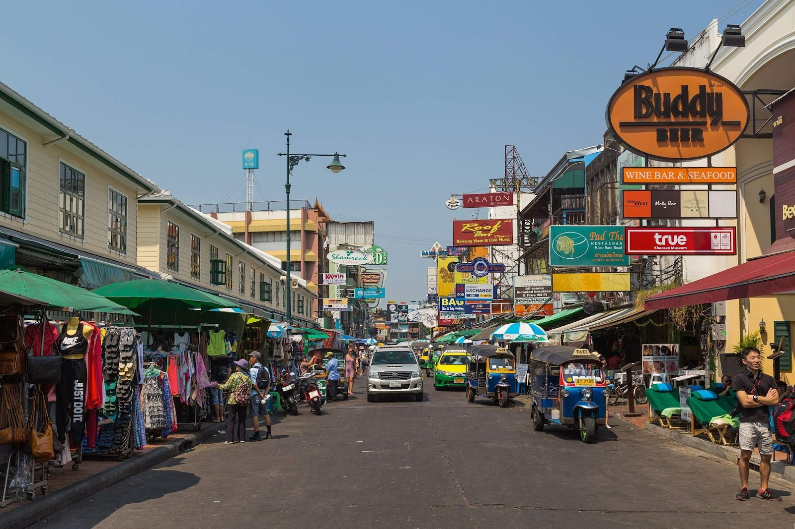
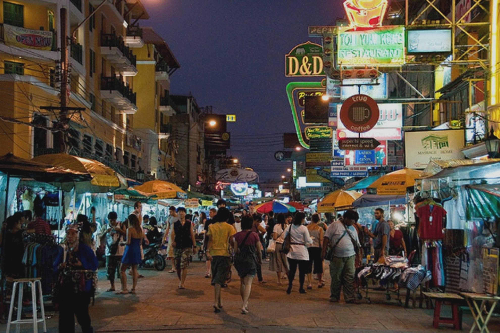

Bangkok is a vibrant city that never fails to amaze visitors. From its rich cultural heritage to its bustling street life, here are 5 must-know facts about Bangkok: The Capital of Thailand.

## 1. Grand Palace: A Majestic Landmark
The Grand Palace is a must-visit attraction in Bangkok. With its intricate architecture and stunning details, this historic landmark was once the residence of Thai Kings. Marvel at the magnificent buildings, including the famous Wat Phra Kaew (Temple of the Emerald Buddha).

## 2. Wat Arun: The Temple of Dawn
Located along the Chao Phraya River, Wat Arun is known for its iconic spires and beautiful mosaic decorations. Climb to the top of the temple to enjoy a breathtaking view of Bangkok's skyline. Don't miss the chance to witness the temple glowing at sunset - a truly magical experience.

## 3. Floating Markets: Experiencing Local Culture
Immerse yourself in the vibrant atmosphere of Bangkok's floating markets. Here, you can shop for fresh produce, sample delicious street food, and interact with friendly locals. The Damnoen Saduak and Amphawa floating markets are among the most popular ones, offering a glimpse into traditional Thai life.

## 4. Street Food Paradise: Culinary Delights
Bangkok is a food lover's paradise, especially when it comes to street food. Explore the city's bustling street stalls and indulge in a variety of mouthwatering dishes. From Pad Thai and Tom Yum Goong to Mango Sticky Rice and Thai-style grilled meats - the options are endless.

## 5. Khao San Road: The Backpacker Hub
Known as the center for backpackers and budget travelers, Khao San Road is a vibrant and lively street in Bangkok. Here, you can find cheap accommodations, street vendors selling everything from clothes to souvenirs, lively bars, and a vibrant nightlife scene. It's a must-visit if you're looking for a unique experience.

With its captivating attractions and diverse experiences, Bangkok has something to offer every traveler. Explore this incredible city and create unforgettable memories.

