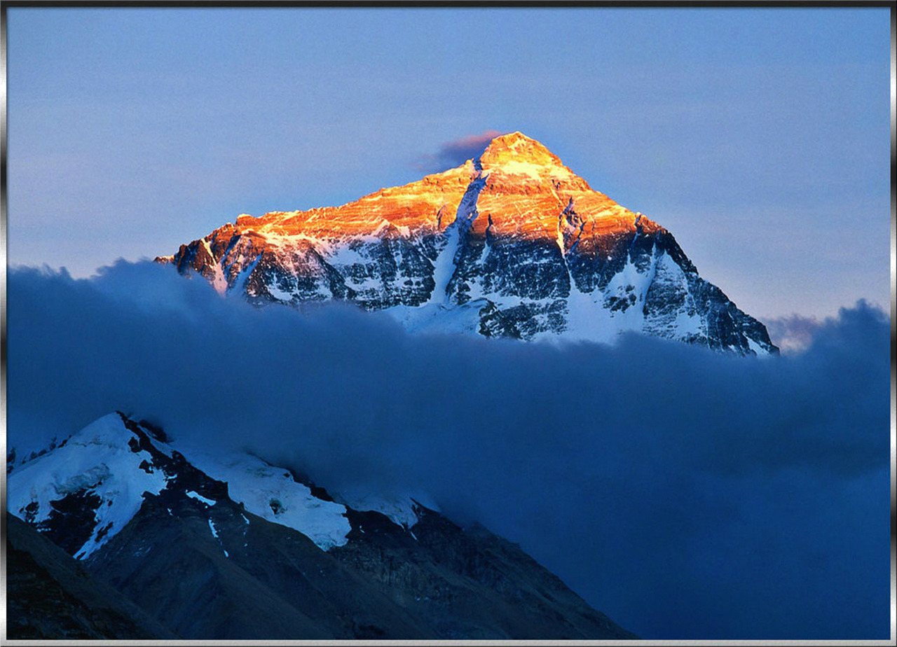
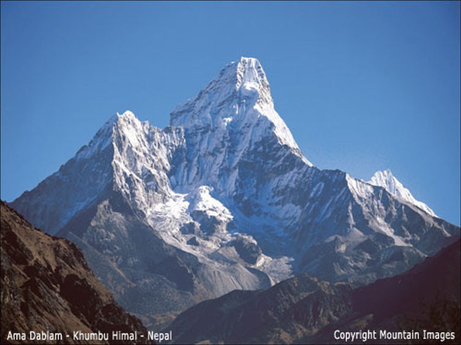
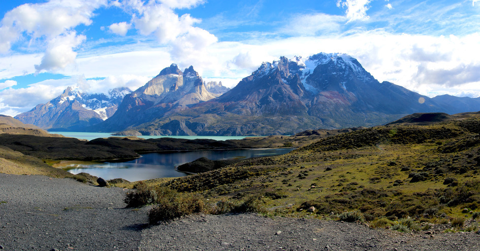
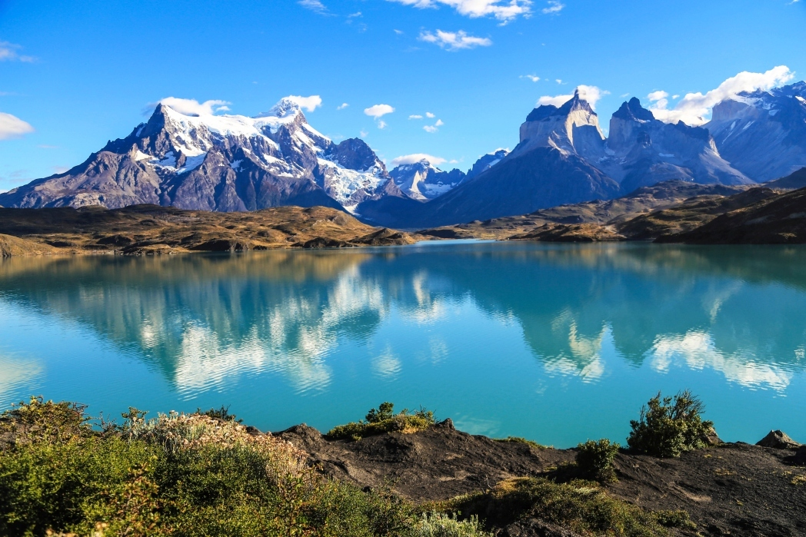
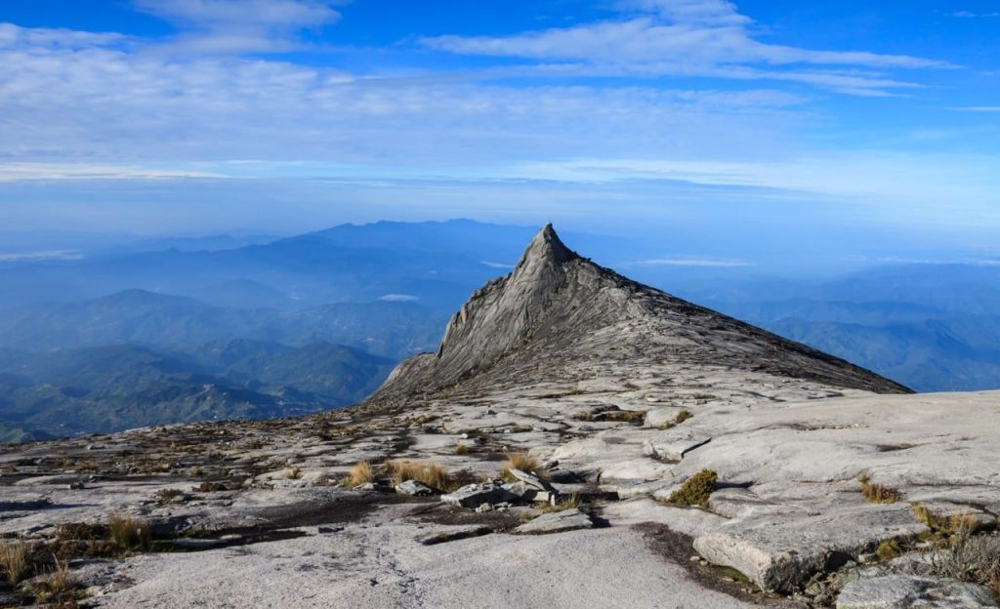
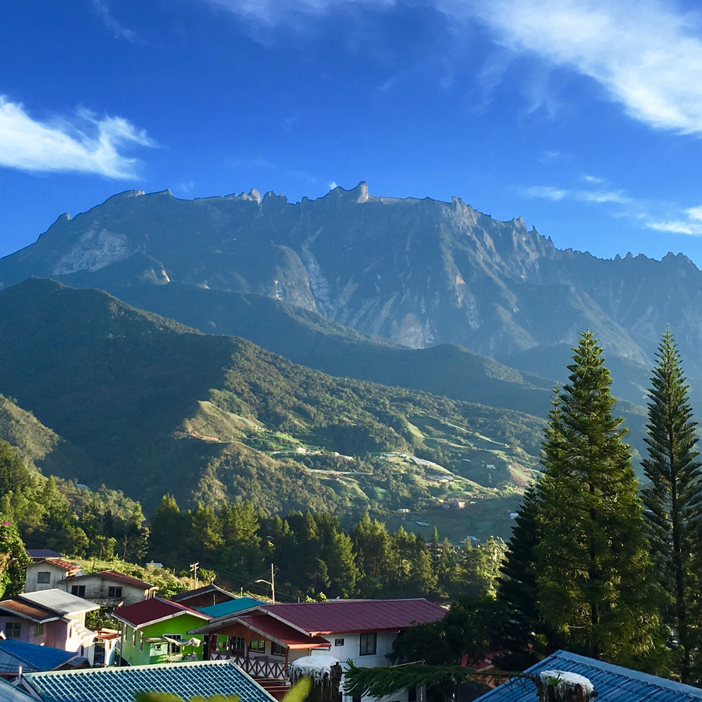

다양한 등산지에서의 탐험은 자연의 아름다움을 경험하고, 신체적, 정신적으로 도전하며, 새로운 문화와 인연을 만들 수 있는 흥미로운 경험을 제공합니다.
이번 회에서는 반드시 알아야 할 전세계 등산지를 탐험해보겠습니다. 그럼 시작해 봅시다!

우리가 꼭 알아야할 세계 등산지

## 1. 히말라야 에베레스트
첫 번째 등산 천국은 히말라야 산맥의 가슴에 위치한 웅장한 에베레스트 베이스 캠프입니다. 세계에서 가장 높은 산인 에베레스트를 정복하거나, 이 지역의 숨막히는 아름다움에 몰입해보세요. 고도에 적응하고 이 도전적인 모험을 위해 적절한 훈련을 받는 것을 잊지 마세요.

## 2. 파타고니아 토레스 델 파이네
그 다음은 남아메리카의 황홀한 파타고니아 지역으로, 아이코닉한 토레스 델 파이네 국립공원이 있는 곳입니다. 거대한 화강암 봉우리, 빙하, 푸른 호수로 가득한 멋진 경치를 거닐면서 본격적인 자연 체험을 즐기세요. 파타고니아 자연 애호가와 사진작가 모두에게 잊지 못할 경험을 선사합니다.

## 3. 보르네오 키나발루
최후의 목적지로 우리는 매혹적인 보르네오 섬의 중심지, 키나발루 산과 키나발루 국립공원을 찾아뵙겠습니다. 빠른 우림을 통해 도심 속 생물다양성을 경험하세요. 이 멋진 봉우리 정상에서 끝나는 숭고한 여정을 준비하세요.

이상으로 우리가 반드시 알아야 할 3 개의 웅장한 등산지를 소개했습니다. 언제나 자연을 존중하고 안전 지침을 따르며 훌륭한 기억을 소중히 여기세요. 즐거운 등산 되세요!