Ayutthaya, the ancient capital of Thailand, holds a special place in history as a UNESCO World Heritage Site. Let's explore five key facts about this fascinating destination.

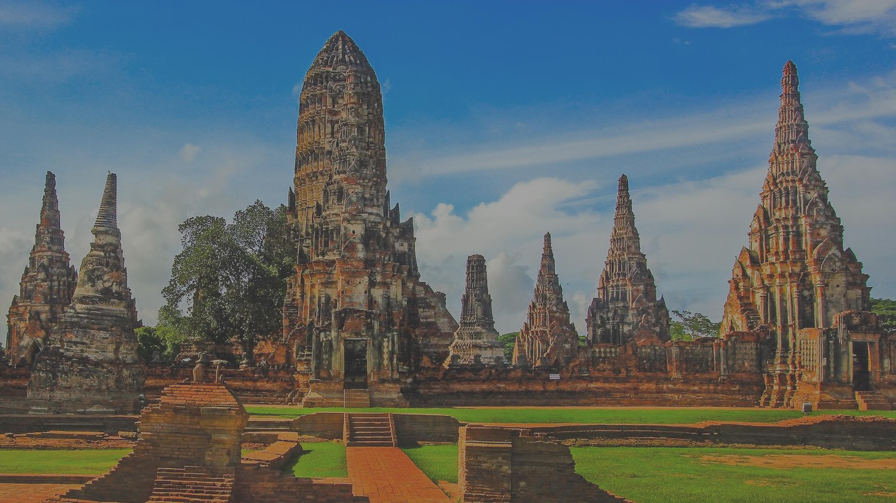

## 1. Historical Significance
Ayutthaya served as the capital of the Kingdom of Siam for over 400 years. It was a flourishing center of trade, culture, and religion. Today, the remnants of the once majestic city include temples, palaces, and sculptures that showcase its rich history.

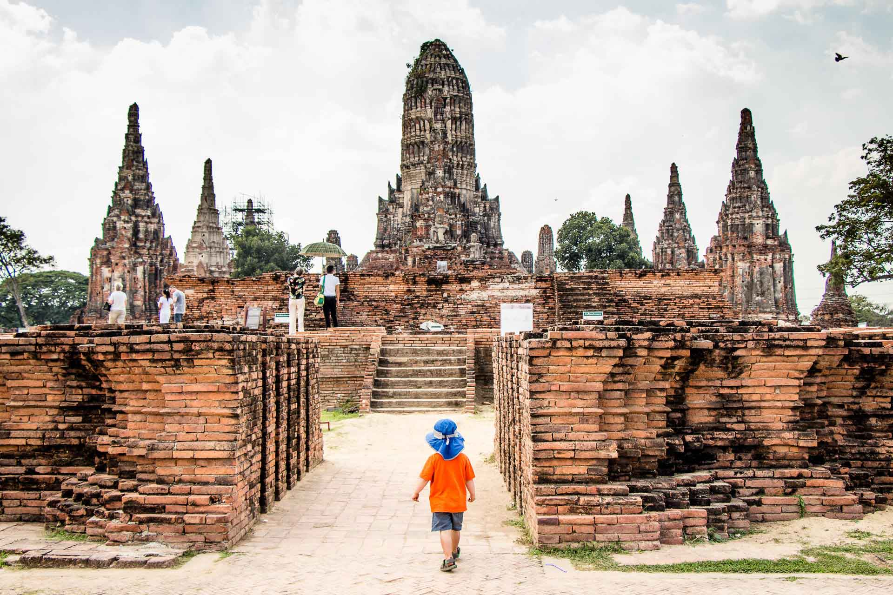
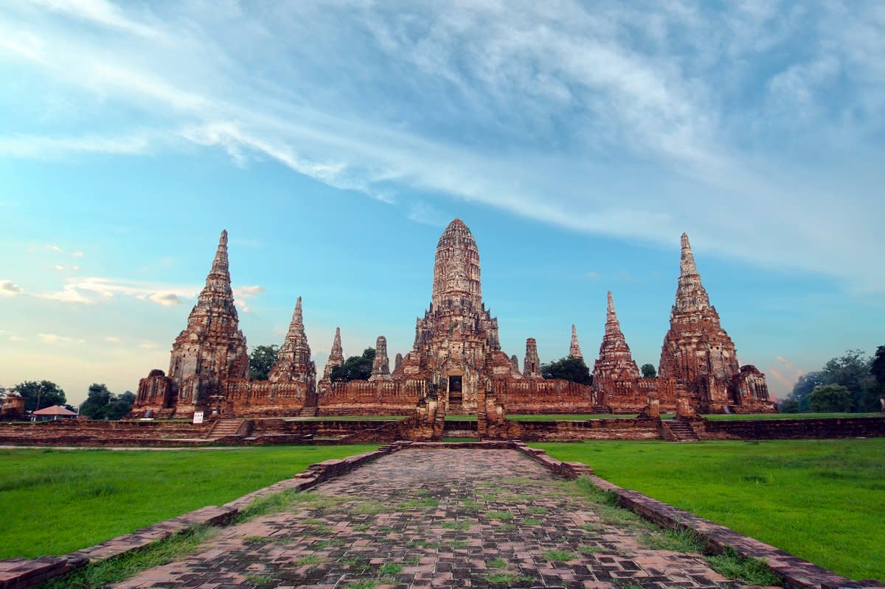

## 2. Wat Mahathat
One of the most iconic landmarks in Ayutthaya is Wat Mahathat. This temple is famous for its impressive Buddha head entwined in the roots of a banyan tree. It is a symbol of the city's ancient glory and is often featured in photographs of Ayutthaya.

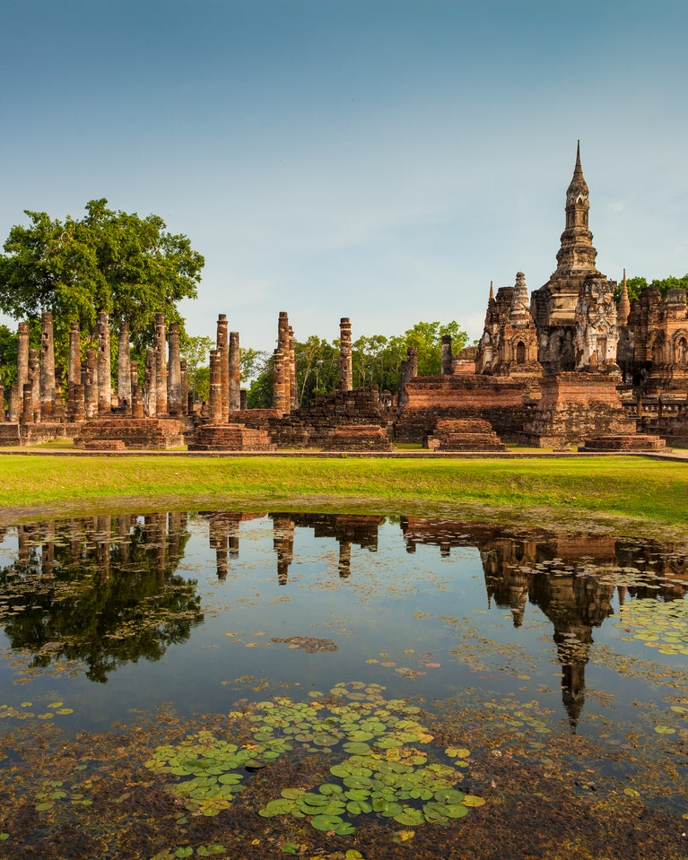
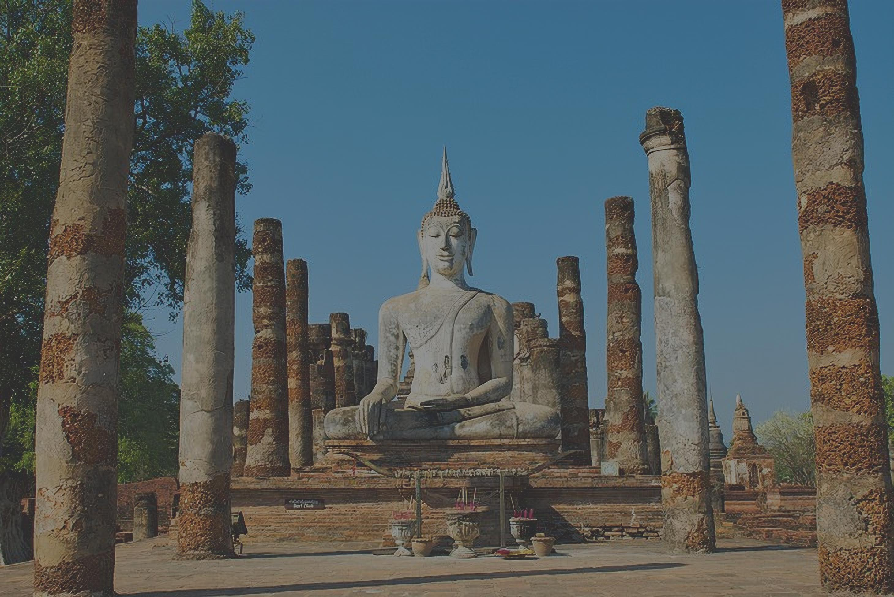

## 3. Ayutthaya's Floating Market
Visiting Ayutthaya's floating market is a unique experience. Here, you can explore traditional wooden boats selling local handicrafts, souvenirs, and delicious Thai street food. Don't miss the opportunity to immerse yourself in the vibrant atmosphere of this cultural gem.

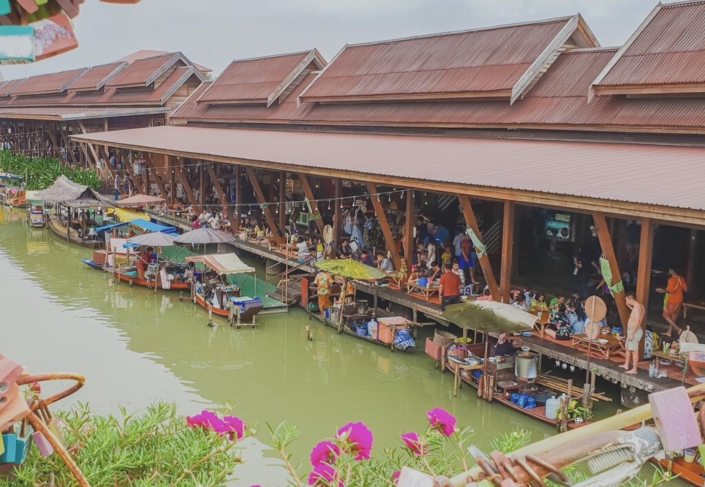
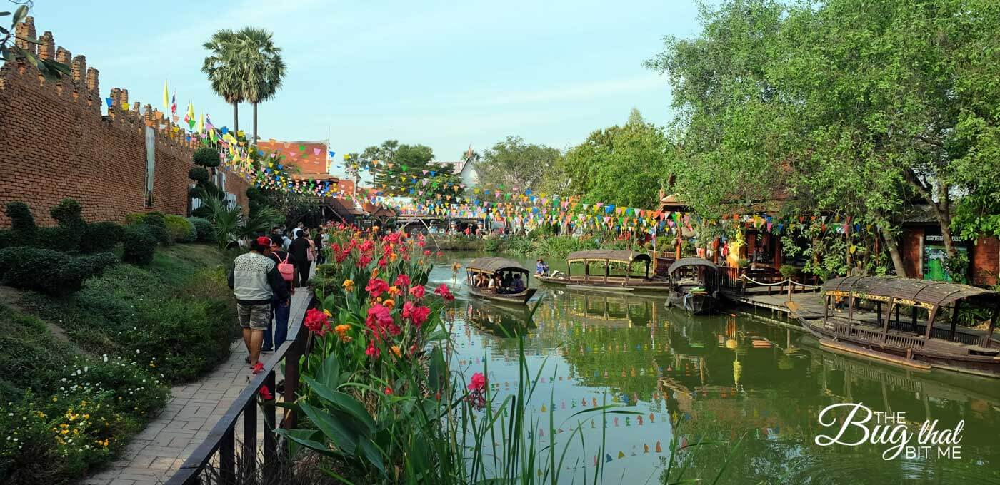

## 4. Ayutthaya Historical Park
The Ayutthaya Historical Park is a vast complex of ruins and archaeological sites. It offers visitors a chance to step back in time and appreciate the architectural marvels of the past. Exploring this park provides a glimpse into the grandeur of Ayutthaya's golden era.

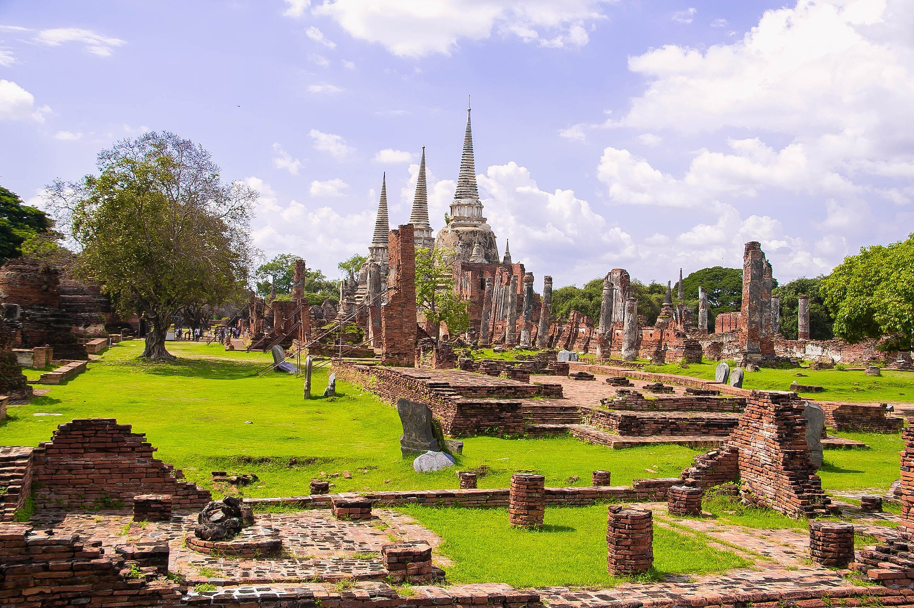
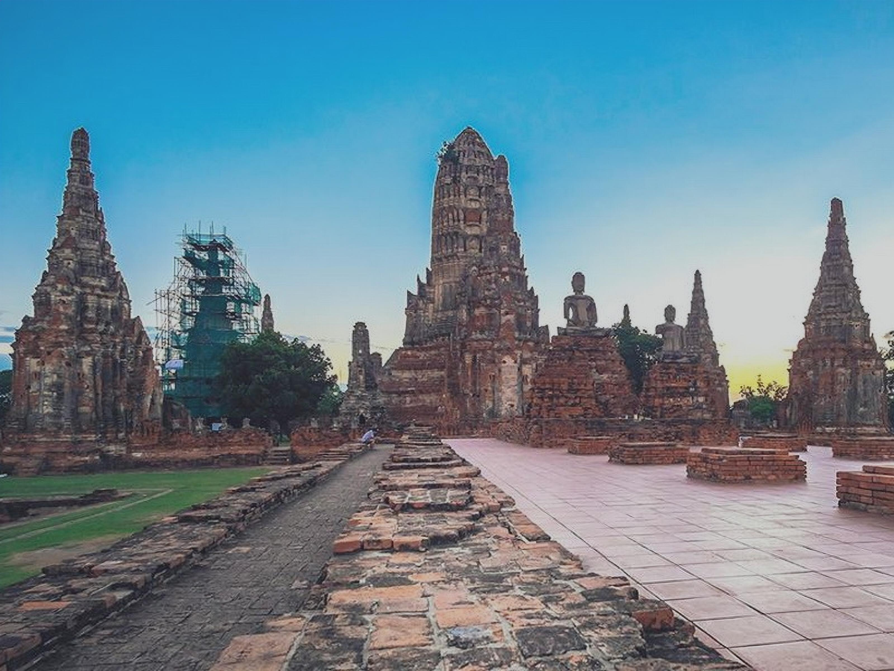

## 5. Chao Sam Phraya National Museum
For history enthusiasts, a visit to the Chao Sam Phraya National Museum is a must. It houses a remarkable collection of artifacts and artworks from Ayutthaya's heyday. From intricate sculptures to exquisite ceramics, the museum offers insights into the region's cultural heritage.

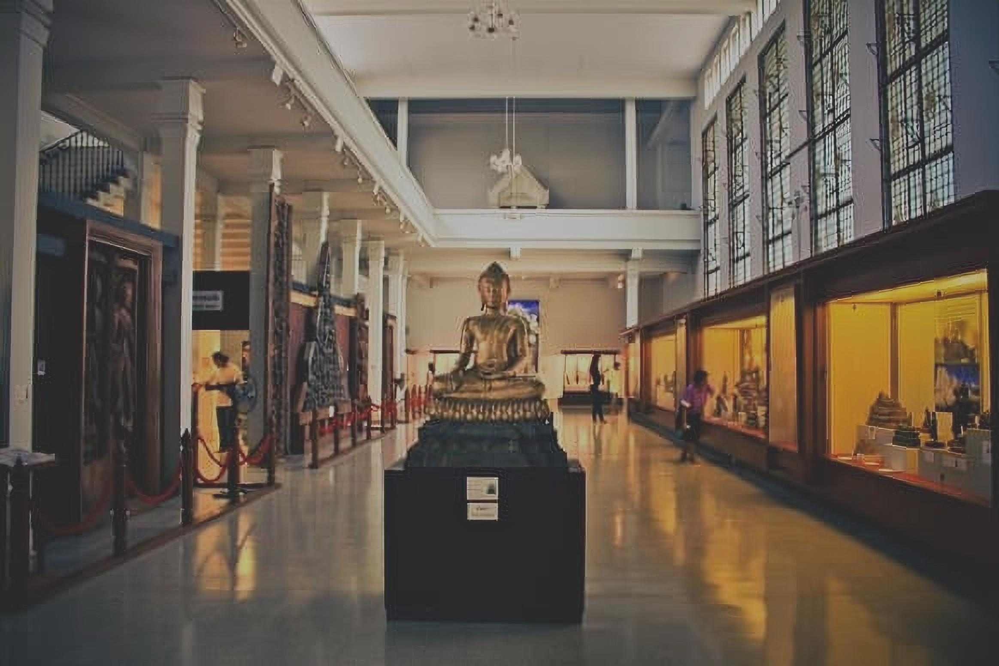
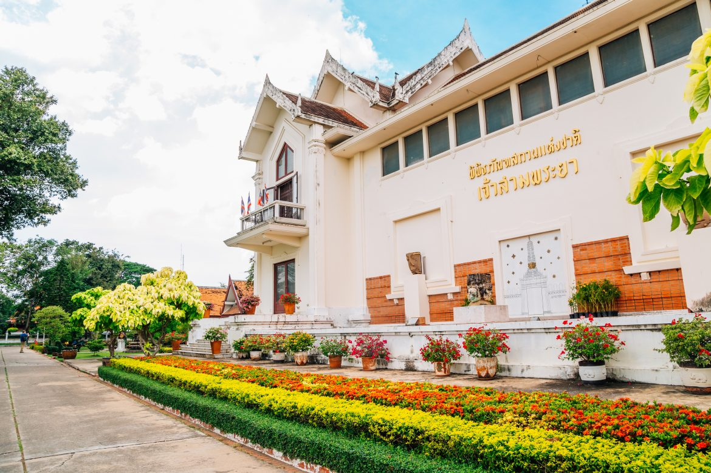

Ayutthaya is a treasure trove of history, art, and spirituality. Its ancient ruins and vibrant traditions make it a captivating destination for travelers from around the world. Experience the splendor and enchantment of Ayutthaya, the ancient capital of Thailand.

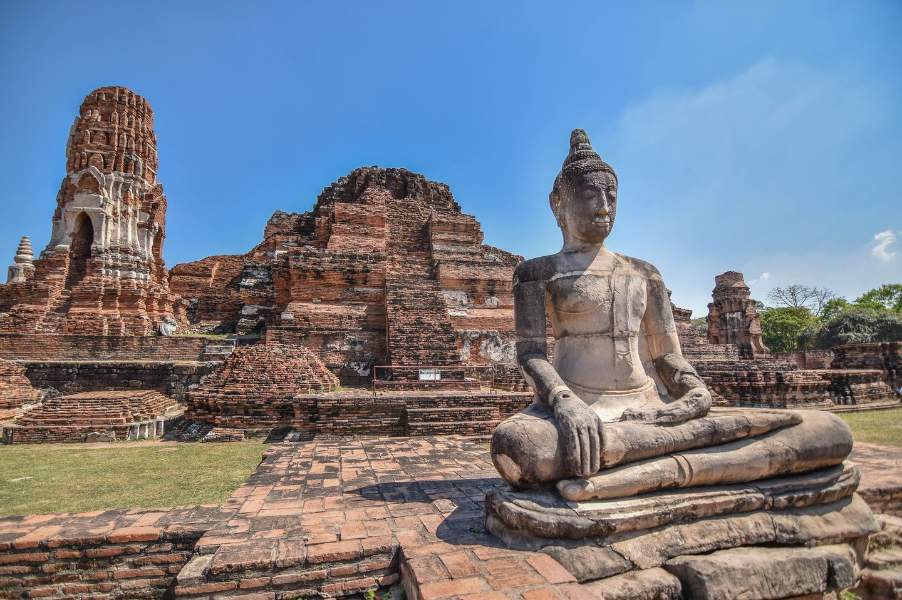
