태국의 고대 수도 아유타야는 유네스코 세계문화유산으로 지정된 역사상 특별한 장소입니다. 이 매력적인 목적지에 대한 다섯 가지 주요 사실을 살펴보겠습니다.

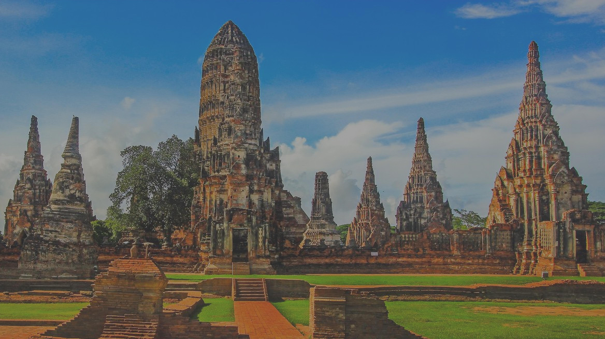

## 1. 역사적 의의
아유타야는 400년 이상 시암 왕국의 수도였습니다. 무역, 문화, 종교의 번성한 중심지였습니다. 오늘날 한때 장엄했던 도시의 잔재에는 풍부한 역사를 보여주는 사원, 궁전 및 조각품이 포함되어 있습니다.

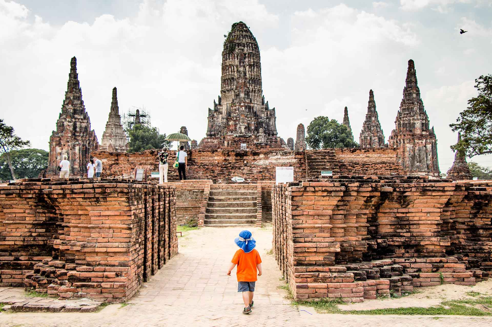
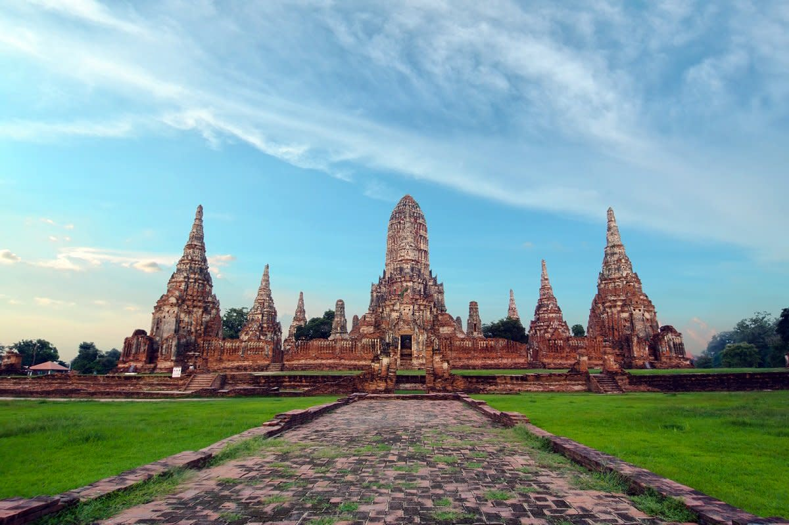

## 2. 왓 마하탓
아유타야에서 가장 상징적인 랜드마크 중 하나는 왓 마하탓입니다. 이 사원은 반얀트리 뿌리에 휘감겨 있는 인상적인 부처 머리로 유명합니다. 그것은 도시의 고대 영광의 상징이며 종종 아유타야 사진에 등장합니다.

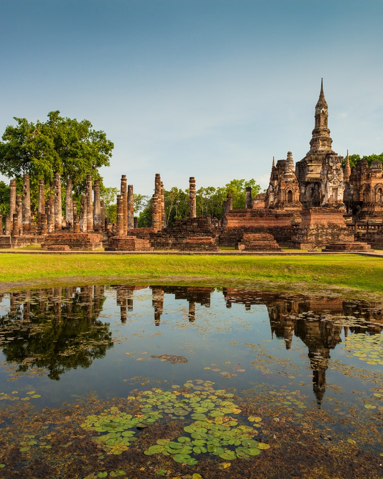
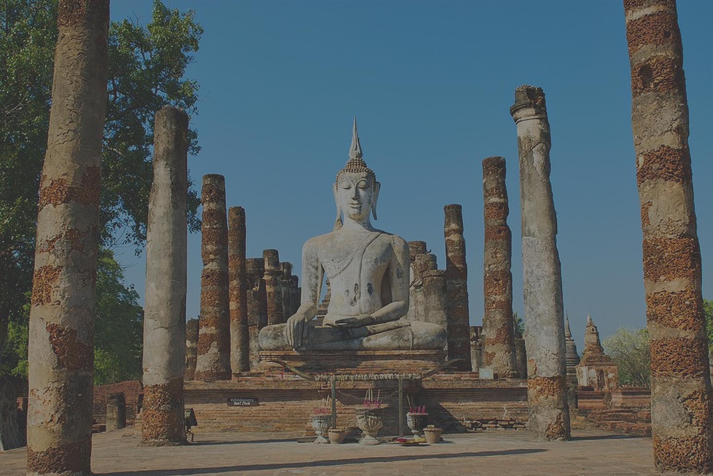

## 3. 아유타야 수상시장
아유타야의 수상 시장을 방문하는 것은 독특한 경험입니다. 여기에서 현지 수공예품, 기념품 및 맛있는 태국 길거리 음식을 판매하는 전통 목조 보트를 둘러볼 수 있습니다. 이 문화적 보석의 활기찬 분위기에 빠져들 기회를 놓치지 마십시오.

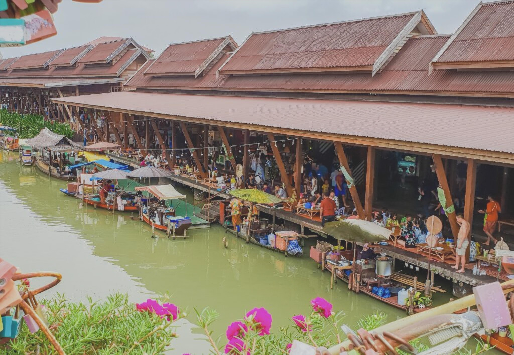
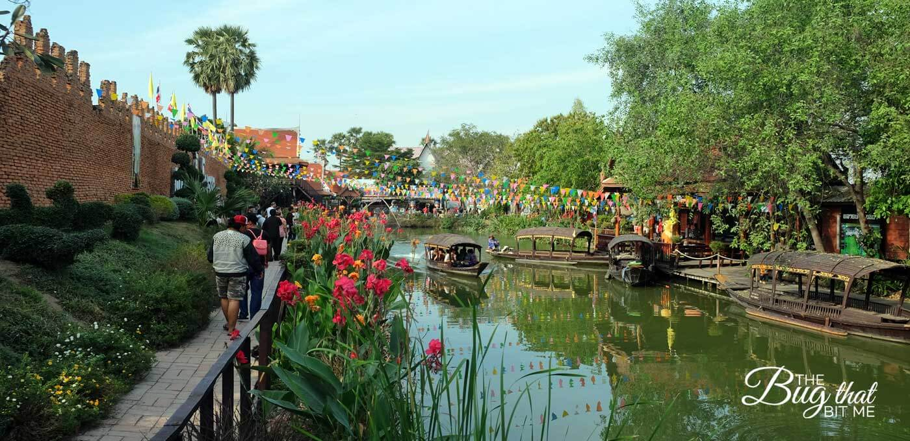

## 4. 아유타야 역사 공원
아유타야 역사 공원은 폐허와 고고학 유적지로 이루어진 광대한 복합 단지입니다. 방문자에게 시간을 거슬러 올라가 과거의 경이로운 건축물을 감상할 수 있는 기회를 제공합니다. 이 공원을 탐험하면 아유타야 황금기의 웅장함을 엿볼 수 있습니다.

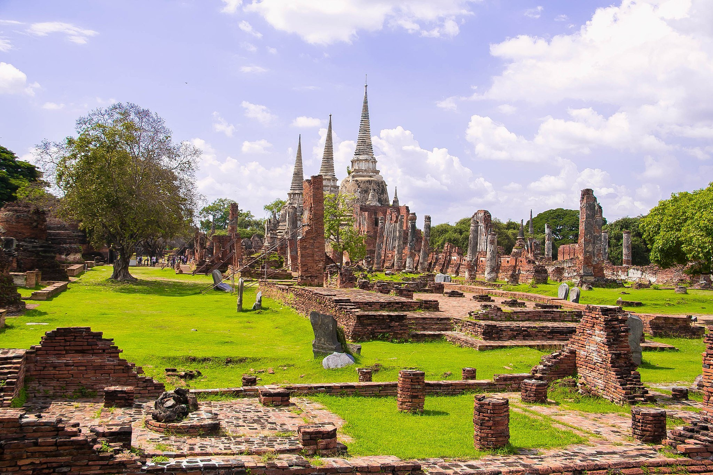
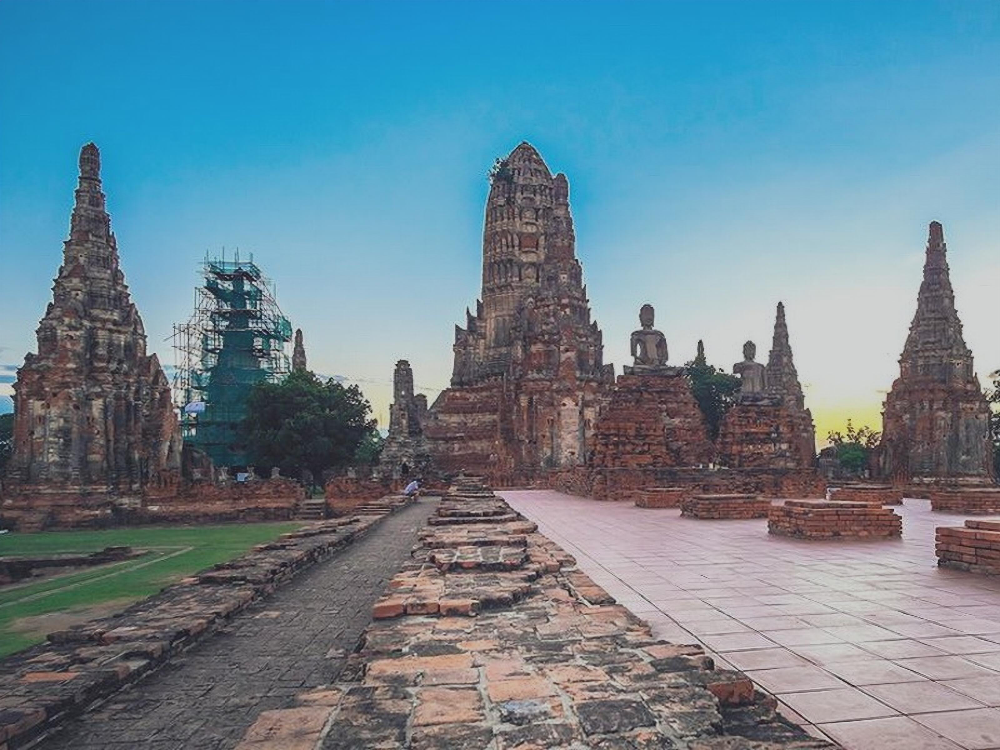

## 5. 차오삼프라야 국립박물관
역사 애호가라면 차오 삼 프라야 국립 박물관을 꼭 방문해야 합니다. 이곳은 아유타야 전성기의 놀라운 유물과 예술품 컬렉션을 소장하고 있습니다. 복잡한 조각품에서 정교한 도자기에 이르기까지 박물관은 지역의 문화 유산에 대한 통찰력을 제공합니다.

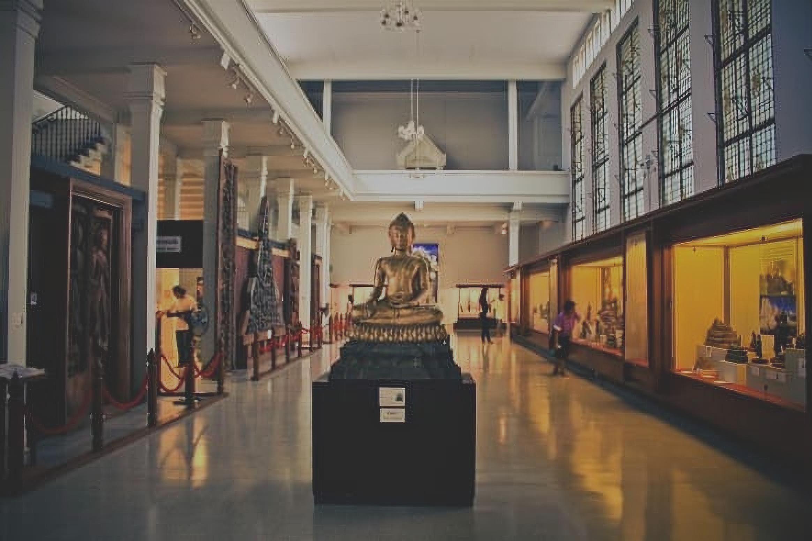
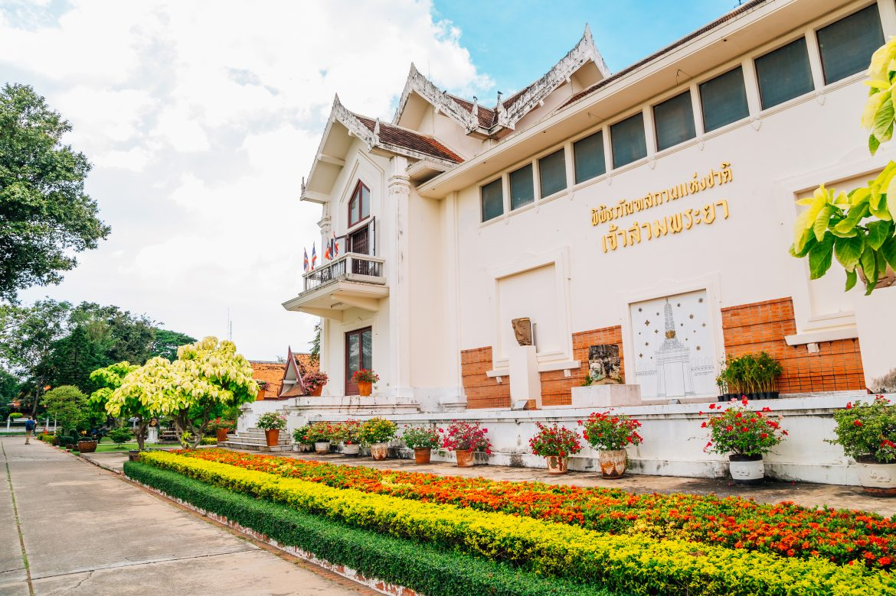

아유타야는 역사, 예술, 영성의 보고입니다. 고대 유적과 활기찬 전통으로 인해 전 세계 여행자들의 마음을 사로잡는 여행지가 되었습니다. 태국의 고대 수도인 아유타야의 화려함과 황홀함을 경험해보세요.

