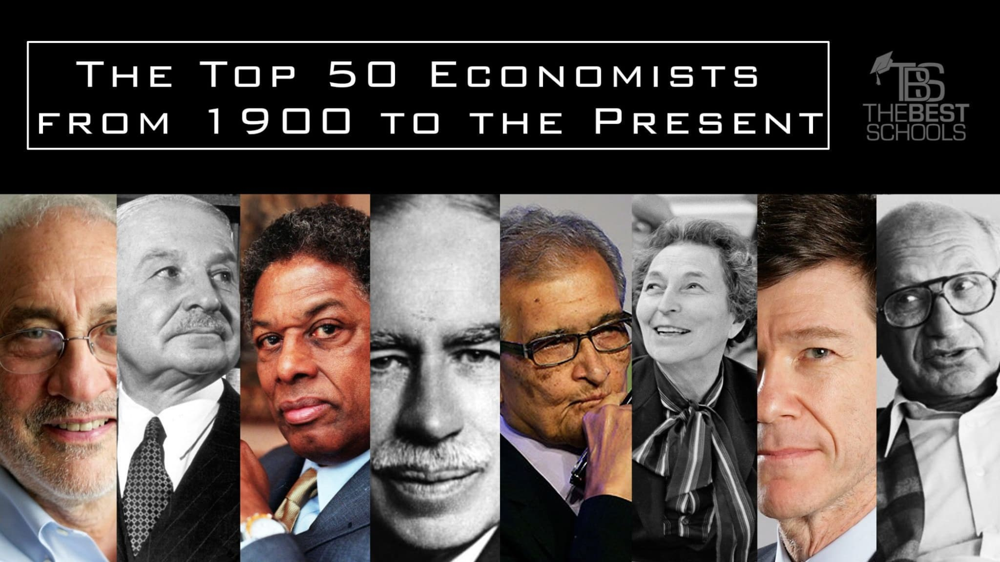
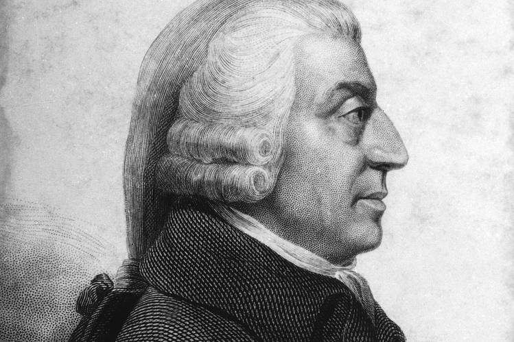
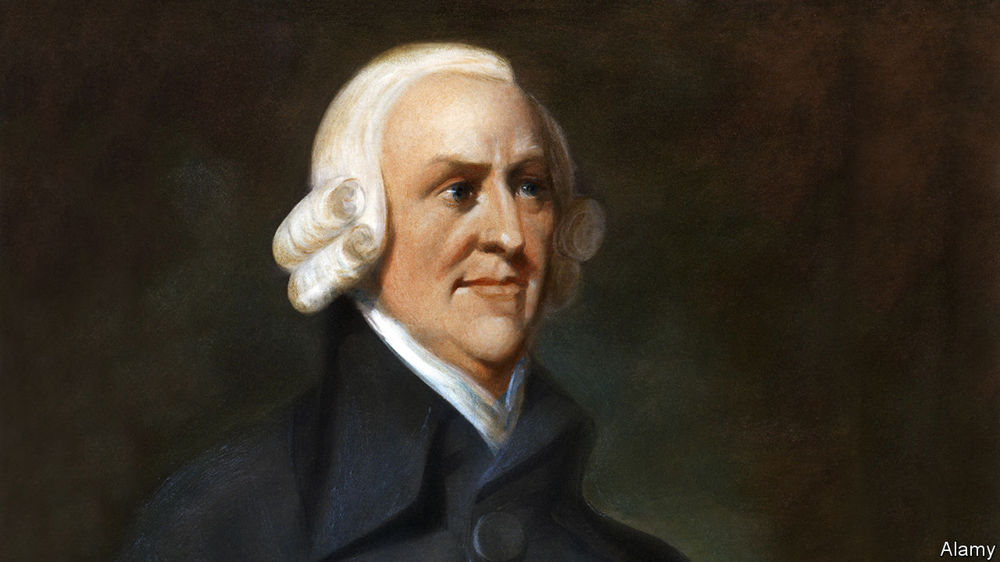
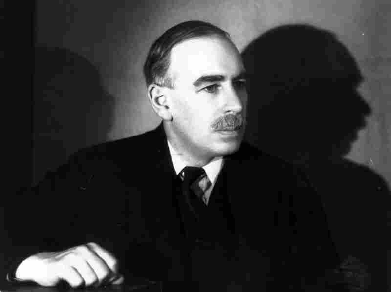
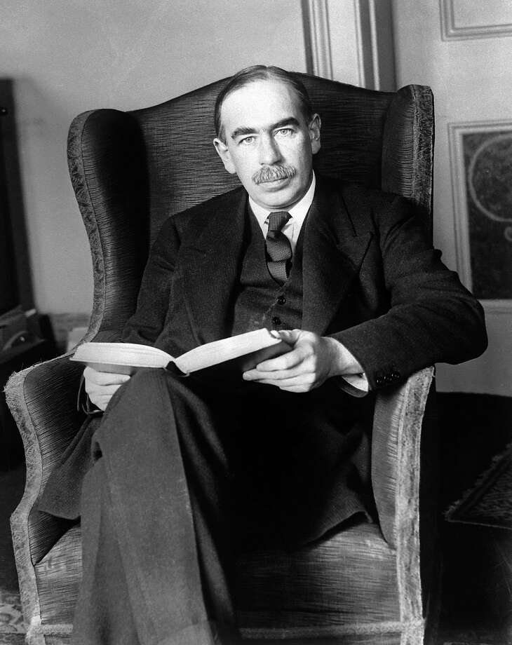
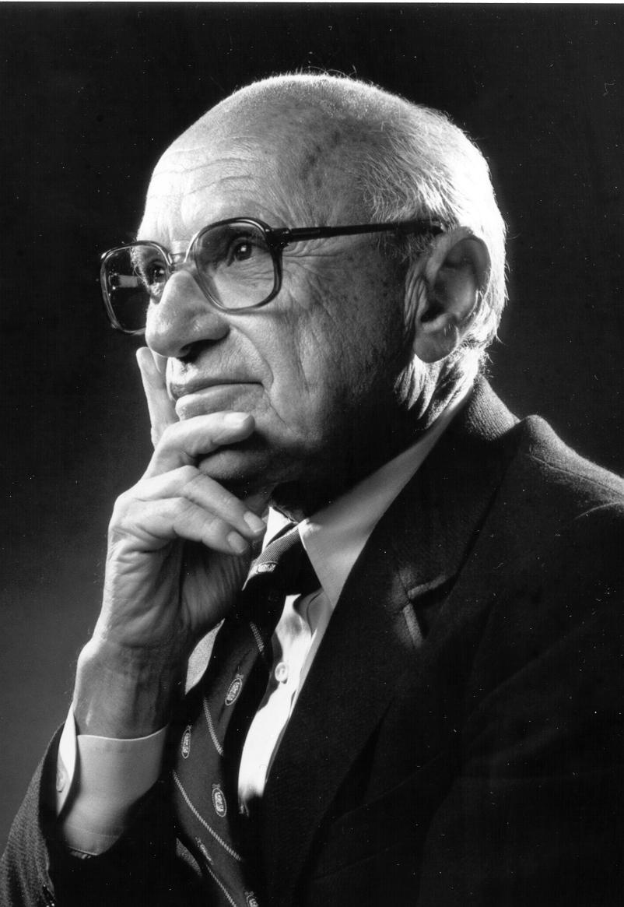
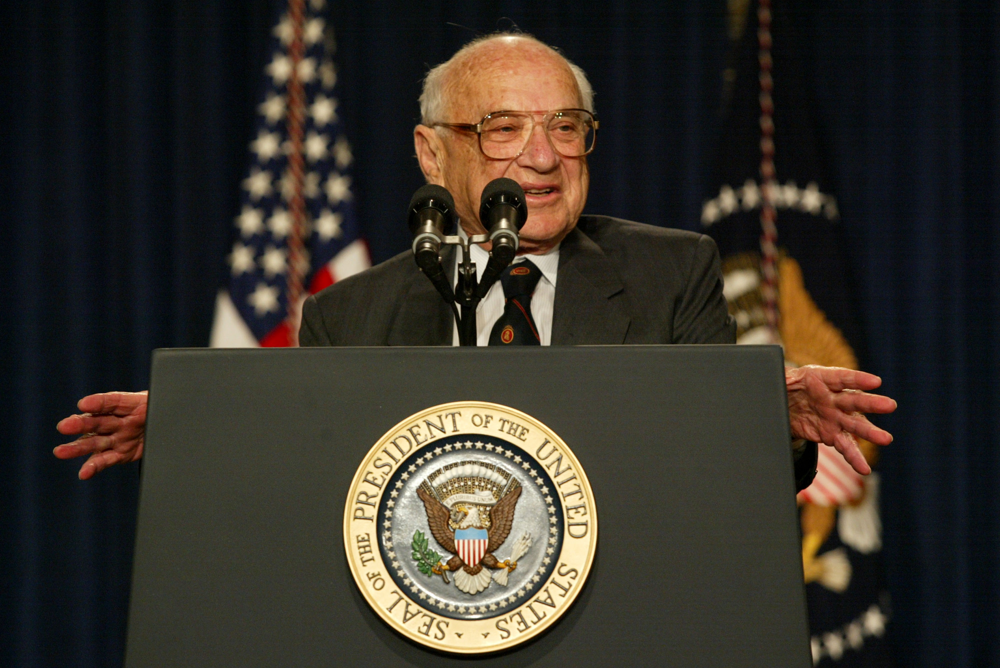

In the field of economics, there are several influential thinkers who have made significant contributions to the discipline. This article highlights three economists that every enthusiast should be familiar with.

## Adam Smith
Adam Smith, often hailed as the father of modern economics, was a Scottish philosopher and economist. His book 'The Wealth of Nations' laid the foundation for classical economics and introduced the concept of the invisible hand, highlighting the role of self-interest and competition in driving economic growth.

## John Maynard Keynes
John Maynard Keynes was a British economist whose ideas revolutionized economic policy during the Great Depression. He advocated for government intervention in the economy to stimulate demand and promote full employment. Keynesian economics remains influential to this day.

## Milton Friedman
Milton Friedman was an American economist and Nobel laureate known for his advocacy of free-market capitalism. He emphasized the importance of monetary policy and argued against government intervention in the economy. Friedman's ideas have had a significant impact on economic theory and policy.

These three economists have shaped the way we understand and analyze economic systems. Their contributions continue to shape economic theories and policies around the world.

