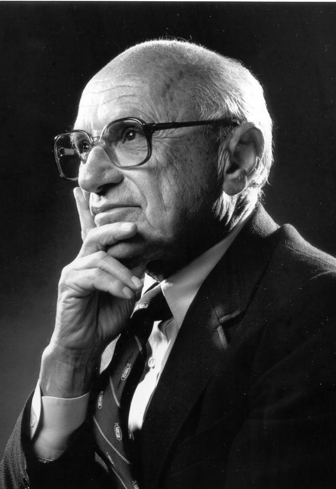
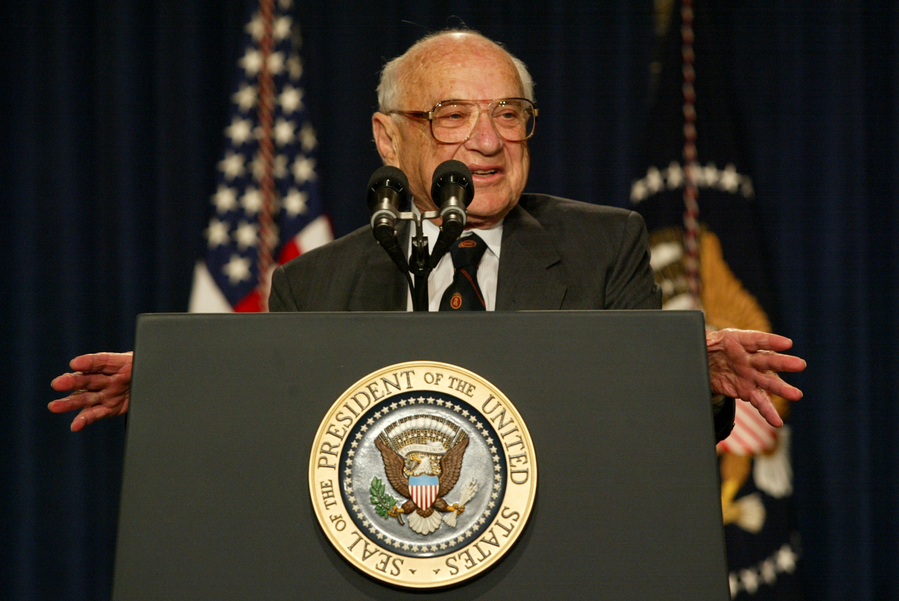

경제학 분야에는 학문에 상당한 공헌을 한 영향력 있는 사상가들이 여럿 있습니다. 이 기사는 모든 열성 팬이 친숙해야 할 세 명의 경제학자를 강조합니다.

## 아담 스미스
종종 현대 경제학의 아버지로 칭송받는 아담 스미스는 스코틀랜드의 철학자이자 경제학자였습니다. 그의 저서 '국부론(The Wealth of Nations)'은 고전 경제학의 토대를 마련하고 보이지 않는 손(Invisible Hand) 개념을 도입하여 경제 성장을 주도하는 이기심과 경쟁의 역할을 강조했습니다.

## 존 메이너드 케인스
John Maynard Keynes는 대공황 동안 경제 정책에 혁명을 일으킨 아이디어를 가진 영국 경제학자였습니다. 그는 수요를 자극하고 완전 고용을 촉진하기 위해 경제에 대한 정부 개입을 옹호했습니다. 케인스주의 경제학은 오늘날까지도 영향력이 있습니다.

## 밀턴 프리드먼
밀턴 프리드먼은 자유 시장 자본주의를 옹호한 것으로 알려진 미국의 경제학자이자 노벨상 수상자였습니다. 그는 통화 정책의 중요성을 강조하고 정부의 경제 개입에 반대했습니다. Friedman의 아이디어는 경제 이론과 정책에 상당한 영향을 미쳤습니다.

이 세 경제학자는 우리가 경제 시스템을 이해하고 분석하는 방식을 형성했습니다. 그들의 기여는 계속해서 전 세계의 경제 이론과 정책을 형성하고 있습니다.

