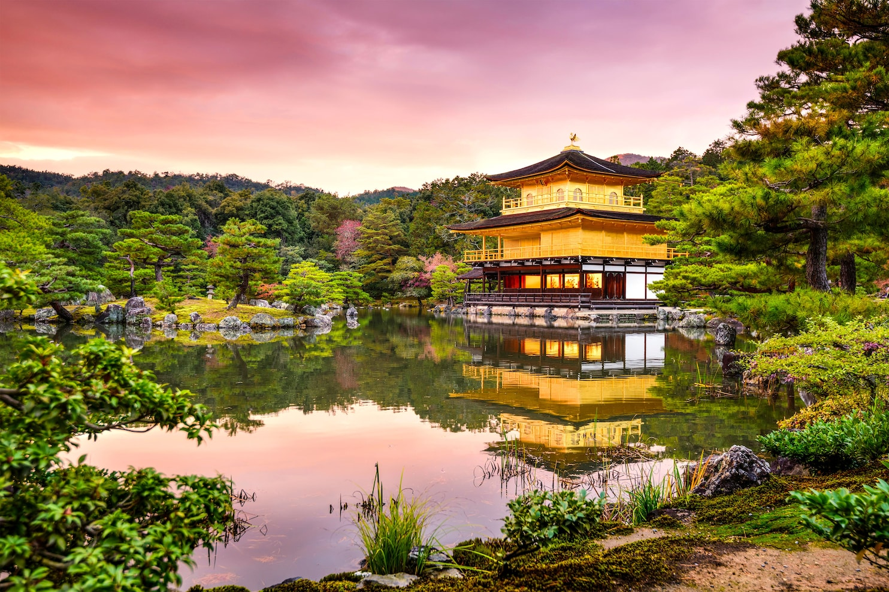
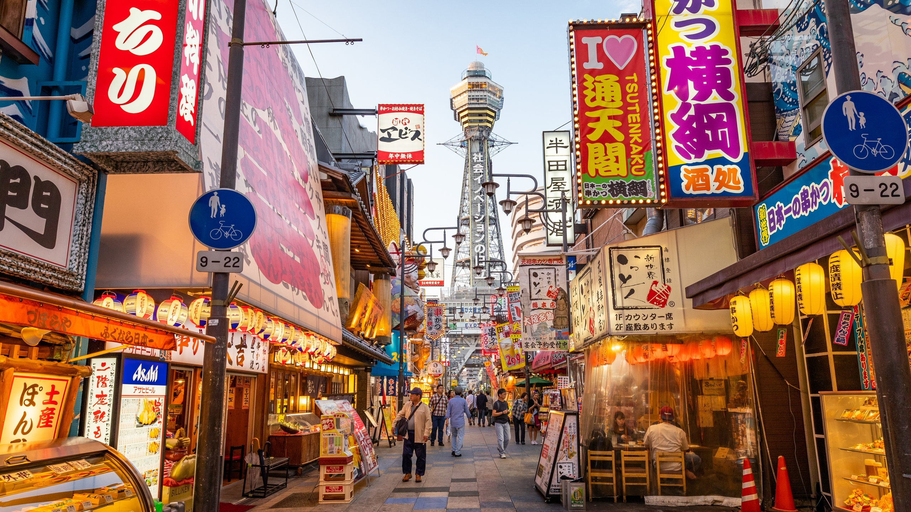
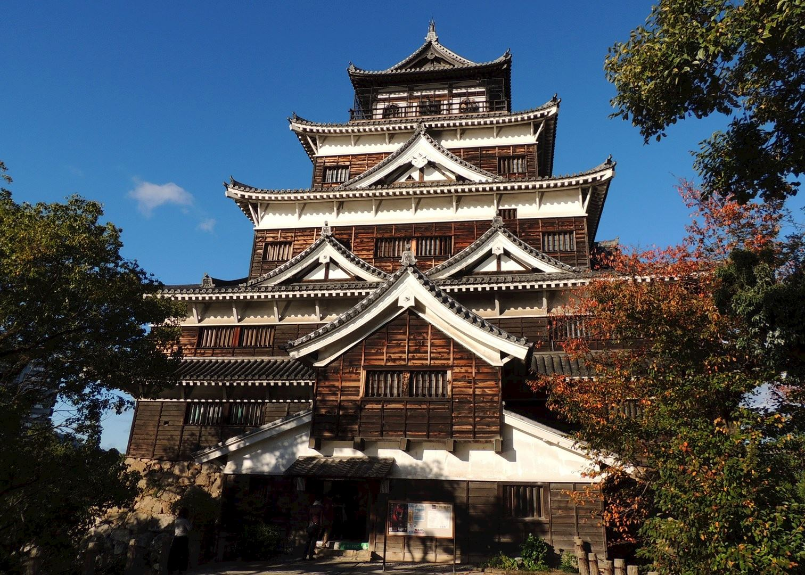
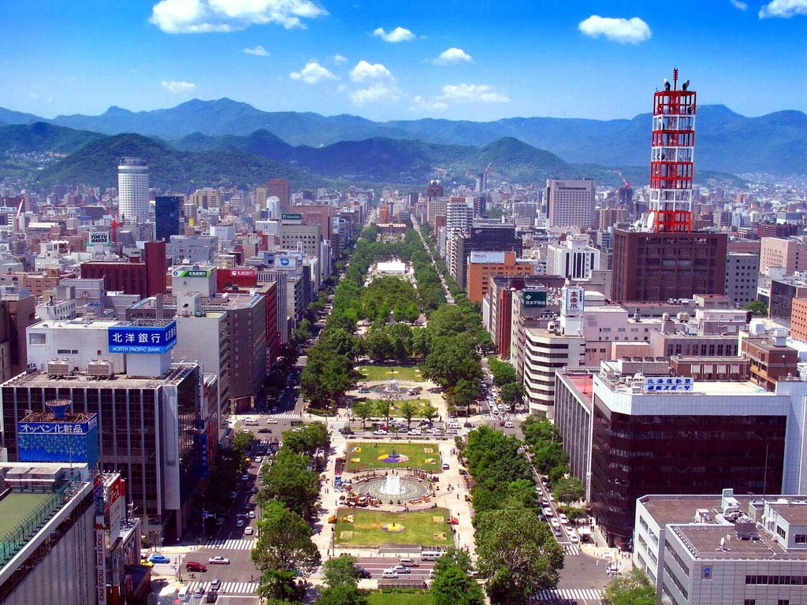

Planning a trip to Japan? Here are five cities that you must include in your itinerary to make your trip unforgettable!

## Tokyo
Explore the vibrant capital city of Japan! Immerse yourself in the bustling streets of Shibuya, visit the historic temples in Asakusa, and indulge in the world-class shopping and dining experiences in Ginza.

## Kyoto
Discover the cultural heart of Japan in Kyoto. Marvel at the iconic Golden Pavilion (Kinkaku-ji), stroll through the enchanting bamboo forest in Arashiyama, and experience the traditional tea ceremonies and geisha performances.

## Osaka
Experience the lively atmosphere of Osaka! Enjoy thrilling rides at Universal Studios Japan, feast on delicious street food at Dotonbori, and explore Osaka Castle, a symbol of the city's rich history.

## Hiroshima
Visit Hiroshima to witness a city's resilience and peace. Pay respects at the Hiroshima Peace Memorial Park and Museum, take a ferry to Miyajima Island to see the iconic Itsukushima Shrine, and savor Hiroshima-style okonomiyaki, a savory pancake.

## Sapporo
Escape to the northern beauty of Sapporo! Enjoy winter sports at the Sapporo Snow Festival, visit the historic Clock Tower, and treat yourself to the city's famous seafood and ramen dishes.

These are just a few of the many incredible cities in Japan waiting to be explored. Each city offers a unique blend of history, culture, and modernity, making Japan a fascinating destination for travelers. Start planning your dream trip to Japan today!

