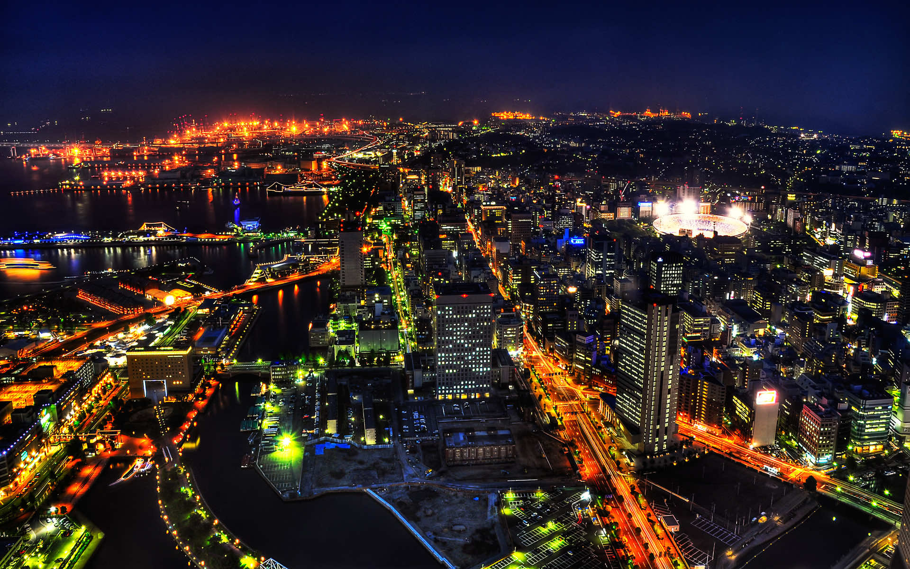
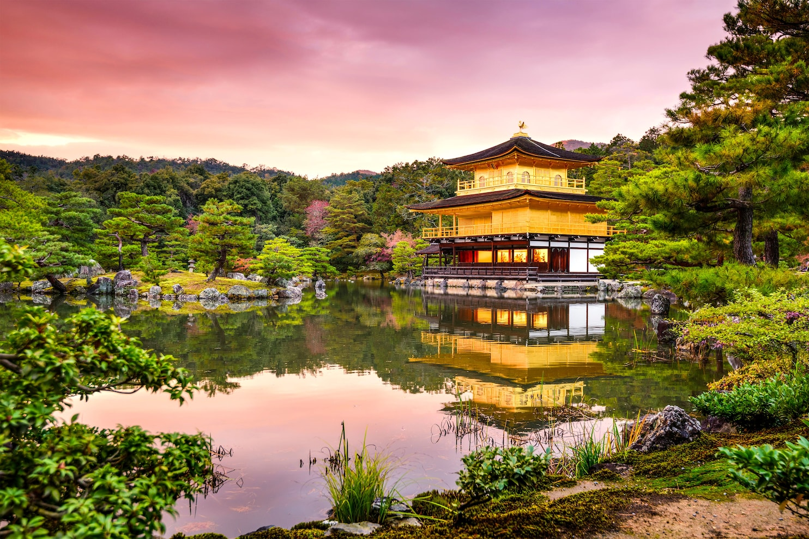
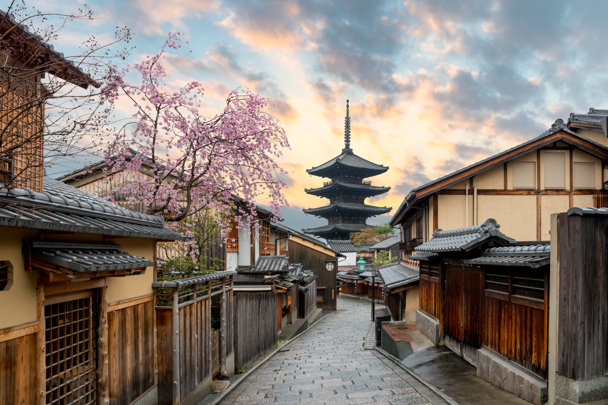
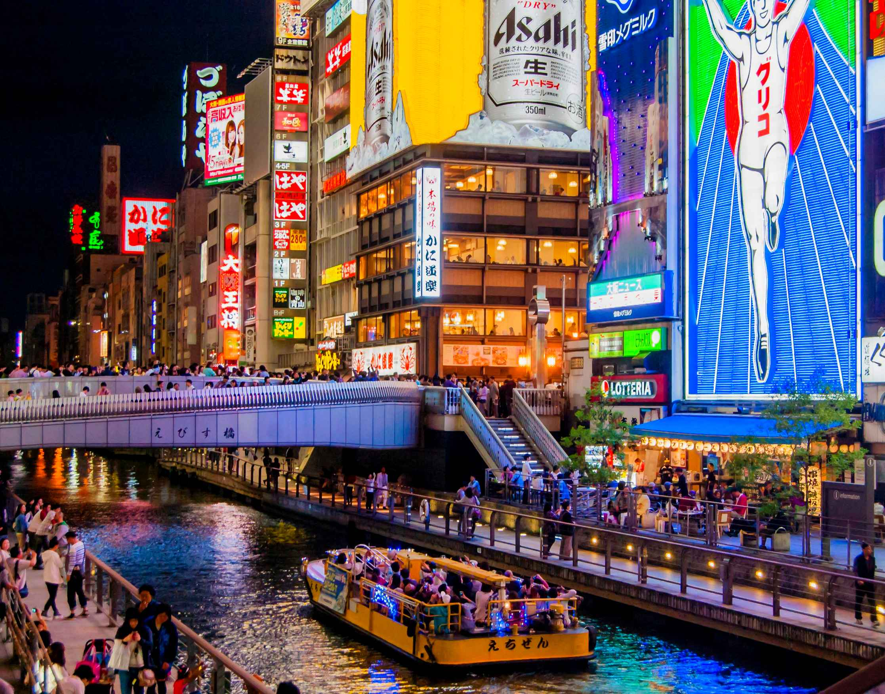
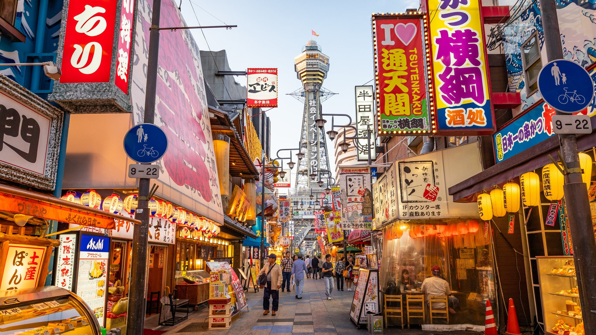
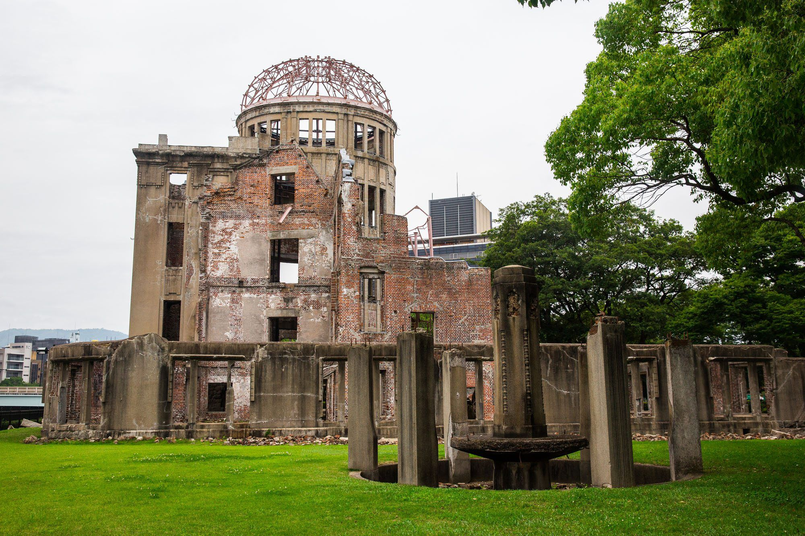
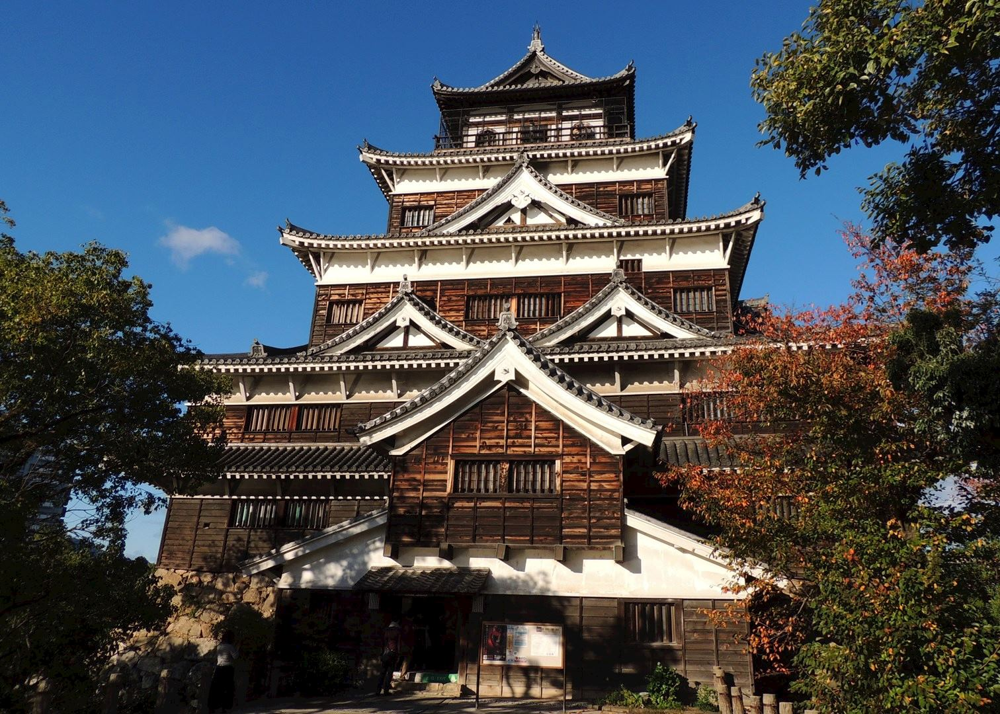
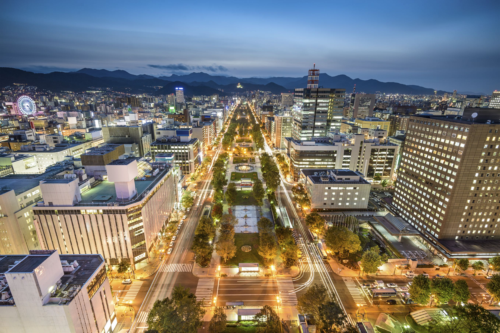
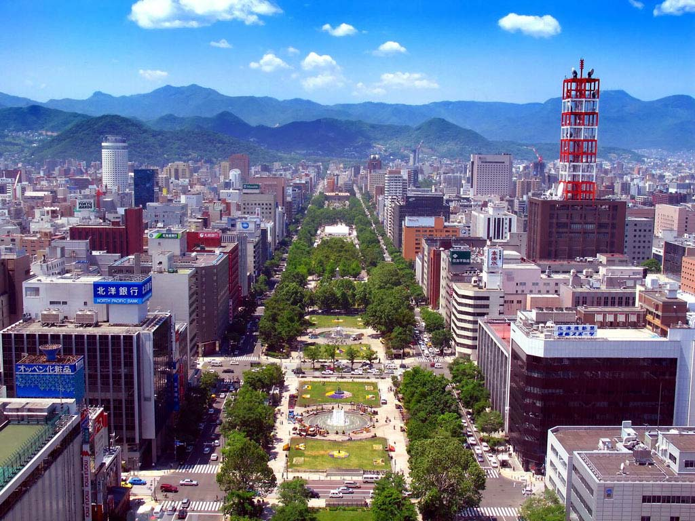
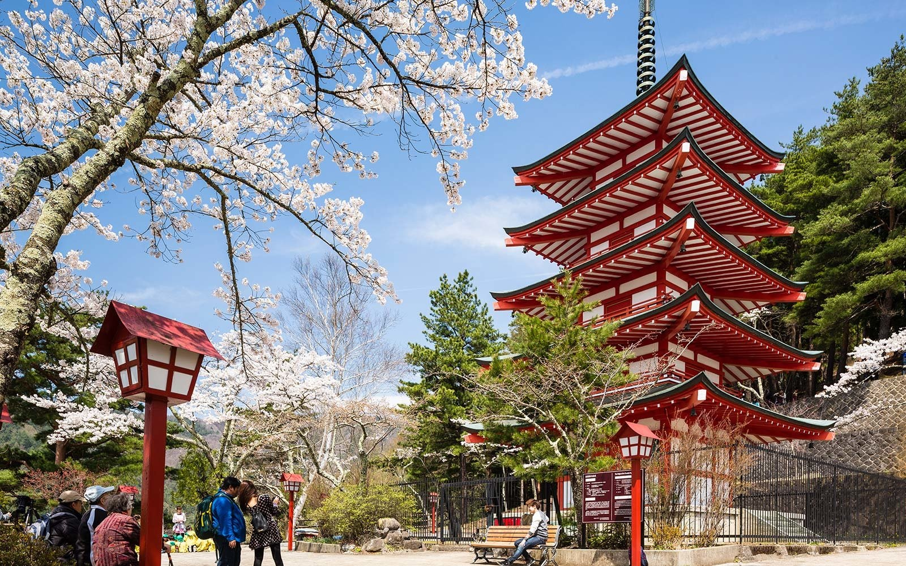

일본 여행을 계획 중이신가요? 잊을 수 없는 여행을 만들기 위해 여정에 포함해야 할 다섯 도시를 소개합니다!

## 도쿄
활기찬 일본의 수도를 탐험해보세요! 시부야의 번화한 거리에 흠뻑 빠져보고 아사쿠사의 유서 깊은 사원을 방문하고 긴자에서 세계적 수준의 쇼핑과 식사 경험에 빠져보세요.

## 교토
교토에서 일본 문화의 중심지를 발견하십시오. 상징적인 금각사를 감상하고 아라시야마의 매혹적인 대나무 숲을 거닐며 전통 다도와 게이샤 공연을 경험해 보세요.

## 오사카
오사카의 활기찬 분위기를 느껴보세요! 유니버셜 스튜디오 재팬에서 스릴 넘치는 놀이기구를 즐기고, 도톤보리에서 맛있는 길거리 음식을 맛보고, 도시의 풍부한 역사를 상징하는 오사카 성을 둘러보세요.

## 히로시마
도시의 탄력성과 평화를 목격하기 위해 히로시마를 방문하십시오. 히로시마 평화 기념 공원 및 박물관에서 경의를 표하고 페리를 타고 미야지마 섬으로 가서 상징적인 이쓰쿠시마 신사를 보고 히로시마식 오코노미야키와 맛있는 팬케이크를 맛보세요.

## 삿포로
북쪽의 아름다움을 지닌 삿포로로 떠나보세요! 삿포로 눈 축제에서 겨울 스포츠를 즐기고 유서 깊은 시계탑을 방문하고 도시의 유명한 해산물 요리와 라면 요리를 즐겨보세요.

이들은 탐험을 기다리고 있는 일본의 수많은 멋진 도시 중 일부에 불과합니다. 각 도시는 역사, 문화 및 현대가 독특하게 조화를 이루고 있어 일본을 여행자들에게 매력적인 목적지로 만듭니다. 오늘 꿈에 그리던 일본 여행을 계획해보세요!

