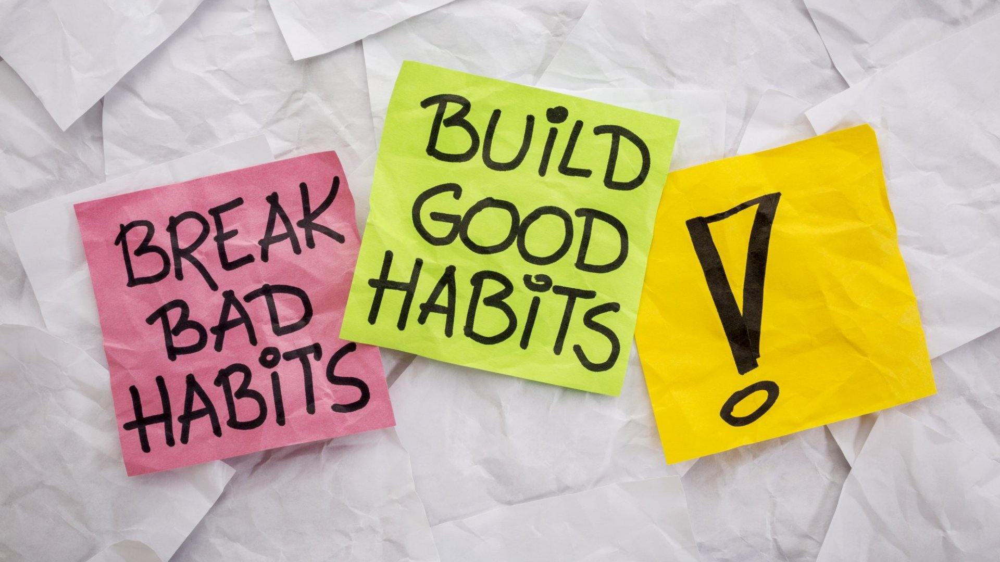

더 건강하고 만족스러운 삶을 위해 모두가 채택해야 할 5가지 필수 좋은 습관을 살펴 보겠습니다.

## 1. 규칙적인 운동
규칙적인 운동은 신체 건강을 개선하고 기분을 좋게 하며 전반적인 에너지 수준을 높이는 데 도움이 됩니다. 걷기, 조깅, 자전거 타기 또는 요가 연습과 같은 활동이 포함될 수 있습니다.

## 2. 건강한 식습관
과일, 채소, 통곡물 및 기름기 없는 단백질이 풍부한 균형 잡힌 식단을 유지하면 최적의 신체 기능을 지원하고 정신적 명료성을 향상시키며 만성 질환의 위험을 낮춥니다.

## 3. 충분한 수면
충분한 수면을 취하는 것은 신체적, 정신적 웰빙에 필수적입니다. 적절한 수면은 인지 기능, 기억력 유지를 개선하고 당뇨병 및 심장병과 같은 만성 질환 발병 위험을 줄이는 데 도움이 됩니다.

## 4. 매일 명상
매일 명상을 연습하면 마음챙김이 향상되고 스트레스 수준이 감소하며 정서적 웰빙이 향상되고 내면의 평화와 명료함이 촉진됩니다.

## 5. 평생학습
지속적으로 지식을 찾고 새로운 기술을 배우는 것은 개인의 성장과 발전을 촉진합니다. 지평을 넓히고 창의성을 높이며 삶의 다양한 측면에서 자신감과 적응력을 높입니다.

이 5가지 좋은 습관을 일상에 적용하면 전반적인 웰빙에 긍정적인 변화를 경험하고 보다 만족스러운 삶을 영위할 수 있습니다.

