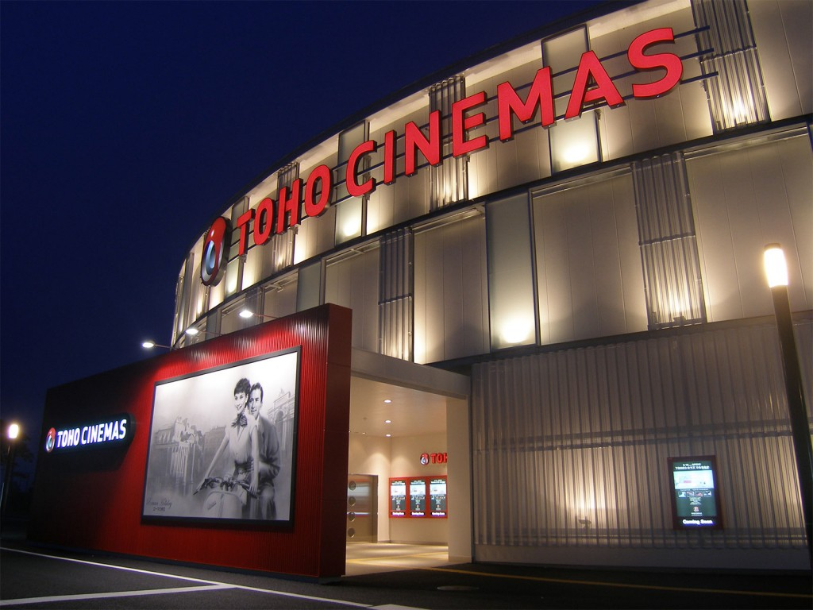
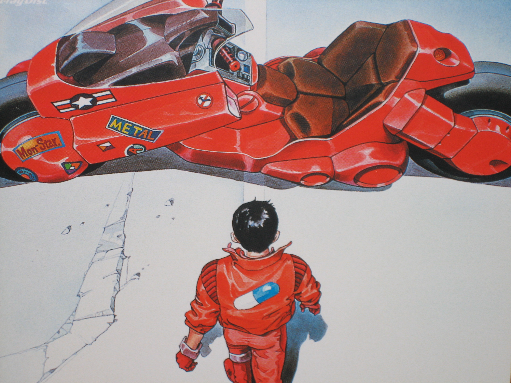
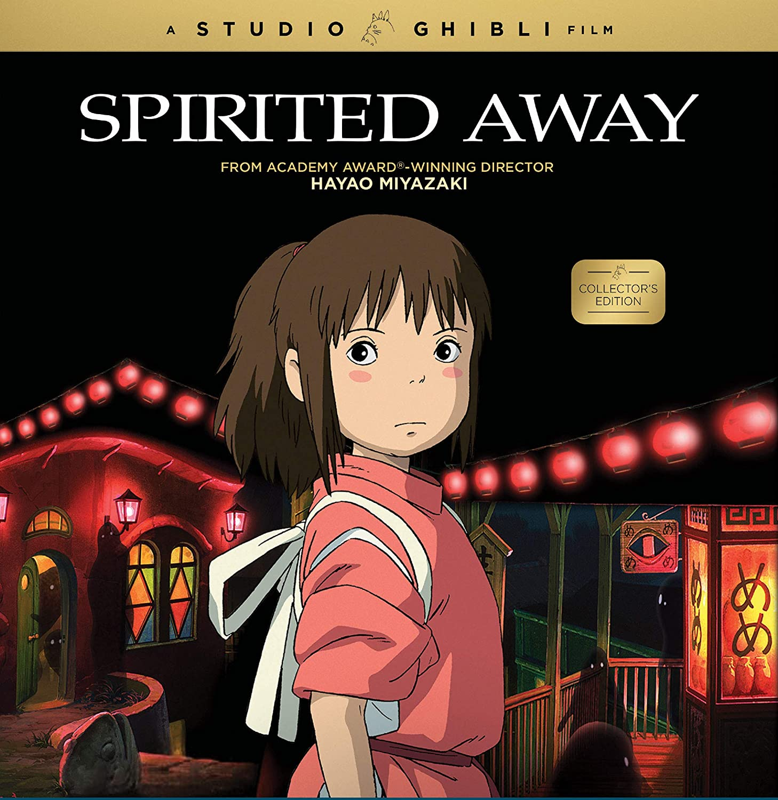
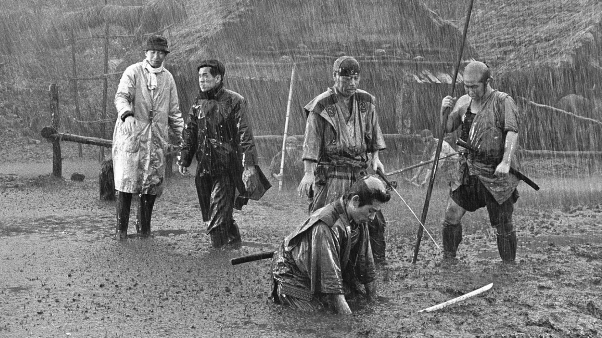

We will explorer 5 must-watch Japanese movies that have made a significant impact in the world of cinema.

## Akira
Akira is a groundbreaking animated film directed by Katsuhiro Otomo. Released in 1988, it is set in a post-apocalyptic Tokyo and follows the story of a young biker gang member who becomes tangled in a government conspiracy. The film is known for its stunning animation and complex storyline.

## Spirited Away
Spirited Away is a masterpiece created by Hayao Miyazaki. This fantasy film tells the enchanting story of a young girl named Chihiro who stumbles into a world populated by spirits and creatures. It won the Academy Award for Best Animated Feature and became the highest-grossing film in Japanese history.

## Rashomon
Rashomon, directed by Akira Kurosawa, is a classic film that explores the concept of truth and perception. The story revolves around a murder case, and each character involved presents a different version of what really happened. Rashomon is widely celebrated for its innovative storytelling techniques.

## Seven Samurai
Seven Samurai, also directed by Akira Kurosawa, is a timeless masterpiece. Set in feudal Japan, the film follows a group of samurais who are hired to defend a village against bandits. It is regarded as one of the greatest action films ever made and has influenced countless filmmakers worldwide.

## Battle Royale
Battle Royale, directed by Kinji Fukasaku, is a controversial yet influential film. It presents a dystopian future in which a group of students is forced to fight to the death on a deserted island. Known for its intense action and social commentary, Battle Royale sparked both praise and controversy upon its release.

These five Japanese movies showcase the diversity and creativity of Japanese cinema. From groundbreaking animations to thought-provoking dramas, these films have left an indelible mark on the world of cinema and continue to be revered by film enthusiasts worldwide.

