영화계에 큰 영향을 미친 꼭 봐야 할 일본 영화 다섯편을 탐험해 보겠습니다.

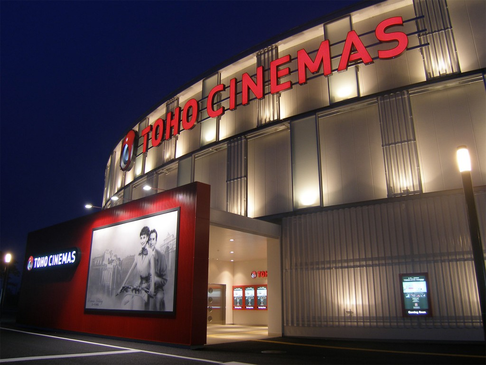

## 아키라
아키라는 Katsuhiro Otomo 감독의 획기적인 애니메이션 영화입니다. 1988년에 출시된 이 영화는 포스트 아포칼립스 도쿄를 배경으로 정부 음모에 얽힌 젊은 폭주족 갱단의 이야기를 따릅니다. 이 영화는 놀라운 애니메이션과 복잡한 스토리로 유명합니다.

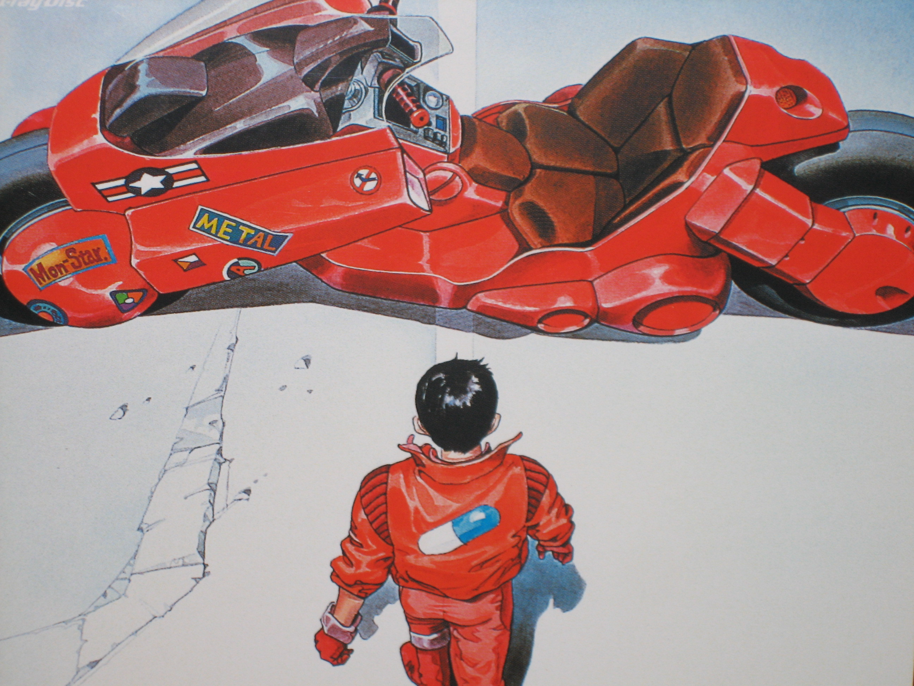
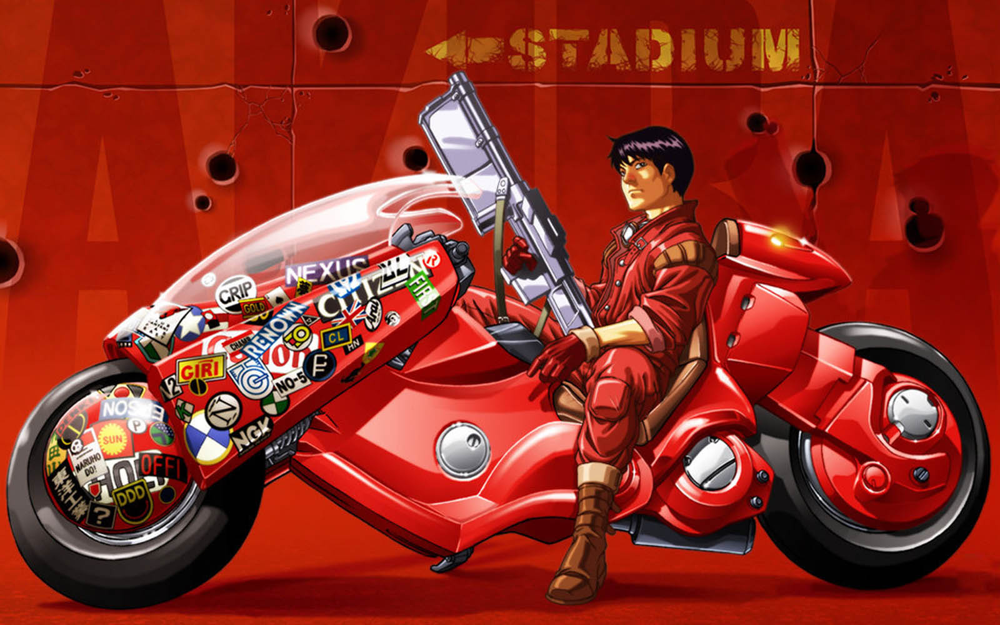

## 센과 치히로의 행방불명
센과 치히로의 행방불명은 미야자키 하야오가 만든 걸작입니다. 이 판타지 영화는 치히로라는 이름의 어린 소녀가 영혼과 피조물이 가득한 세계로 비틀거리며 들어가는 매혹적인 이야기를 담고 있습니다. 최고의 애니메이션 장편 아카데미 상을 수상했으며 일본 역사상 가장 높은 수익을 올린 영화가되었습니다.

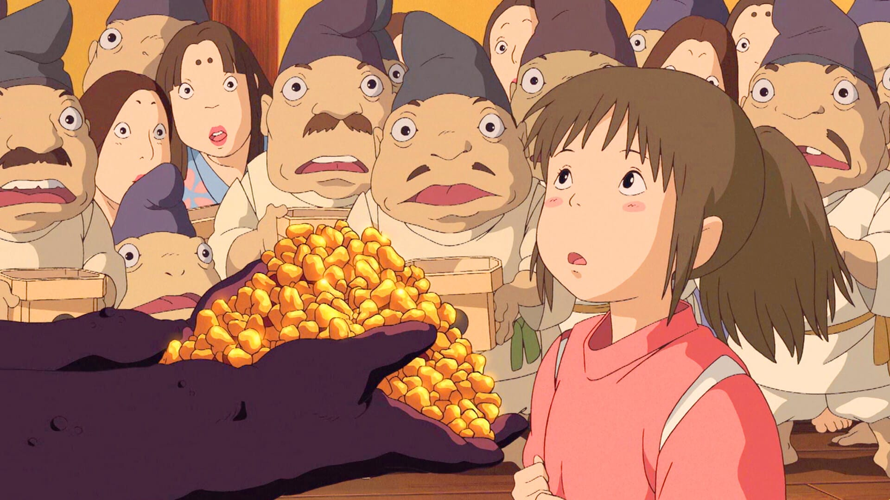

## 라쇼몽
구로사와 아키라 감독의 라쇼몽은 진실과 지각의 개념을 탐구하는 고전 영화입니다. 이야기는 살인 사건을 중심으로 진행되며 관련된 각 캐릭터는 실제로 일어난 일의 다른 버전을 제시합니다. 라쇼몽은 혁신적인 스토리텔링 기술로 널리 알려져 있습니다.

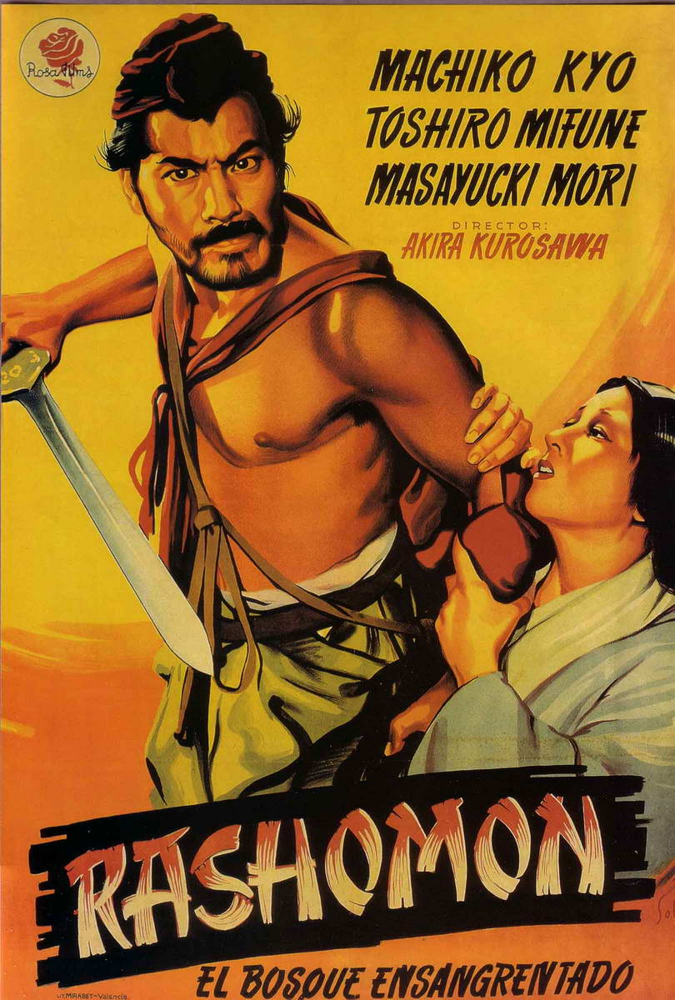
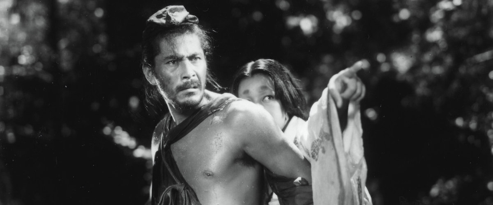

## 7인의 사무라이
7인의 사무라이 역시 구로사와 아키라 감독의 시대를 초월한 걸작입니다. 봉건 시대 일본을 배경으로 한 이 영화는 산적들로부터 마을을 지키기 위해 고용된 사무라이 무리를 따라갑니다. 그것은 지금까지 만들어진 가장 위대한 액션 영화 중 하나로 간주되며 전 세계 수많은 영화 제작자에게 영향을 미쳤습니다.

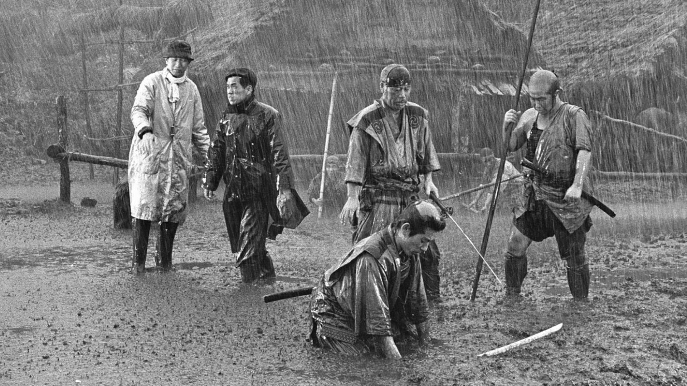
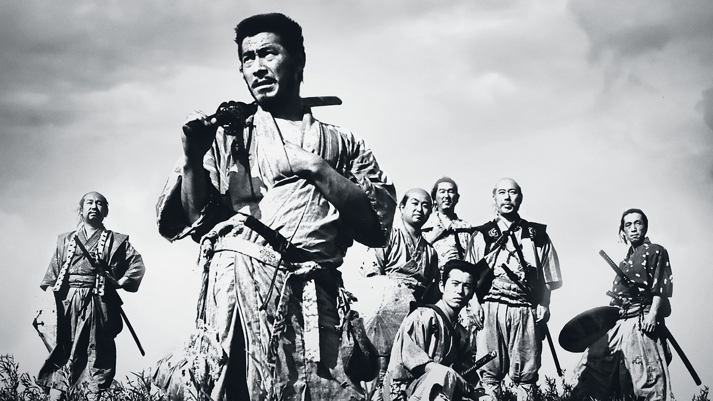

## 배틀 로얄
Kinji Fukasaku가 감독한 배틀 로얄은 논란의 여지가 있지만 영향력 있는 영화입니다. 그것은 한 무리의 학생들이 무인도에서 죽을 때까지 싸워야 하는 디스토피아적 미래를 제시합니다. 격렬한 액션과 사회적 논평으로 유명한 배틀 로얄은 출시와 동시에 찬사와 논란을 불러일으켰습니다.

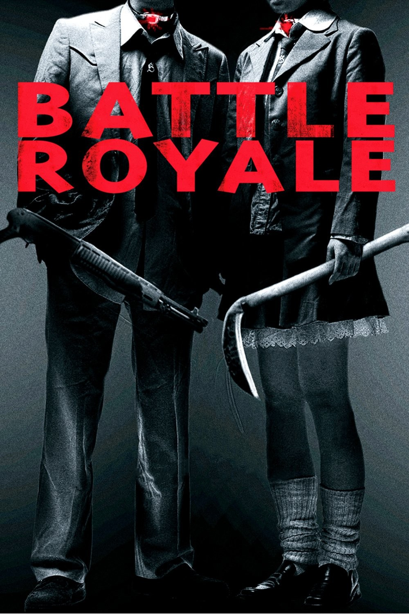
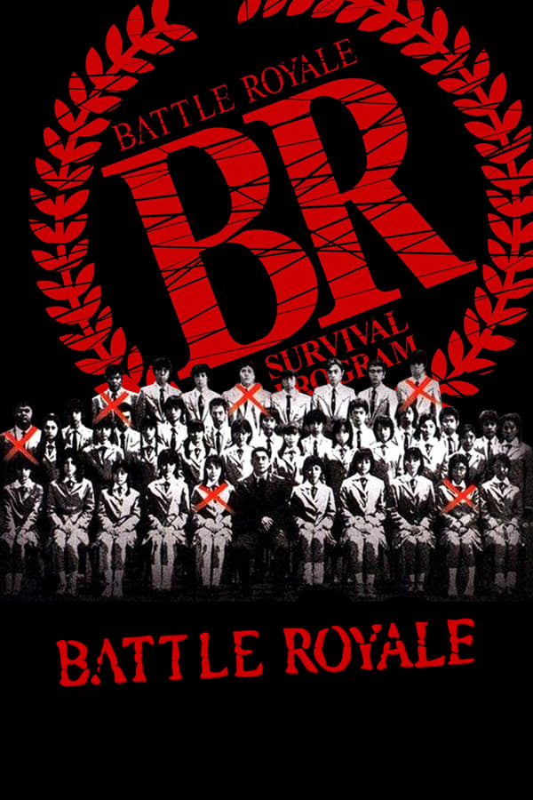

이 다섯 편의 일본 영화는 일본 영화의 다양성과 창의성을 보여줍니다. 획기적인 애니메이션부터 생각을 자극하는 드라마에 이르기까지 이 영화들은 영화계에 지울 수 없는 족적을 남겼으며 전 세계 영화 애호가들의 존경을 받고 있습니다.

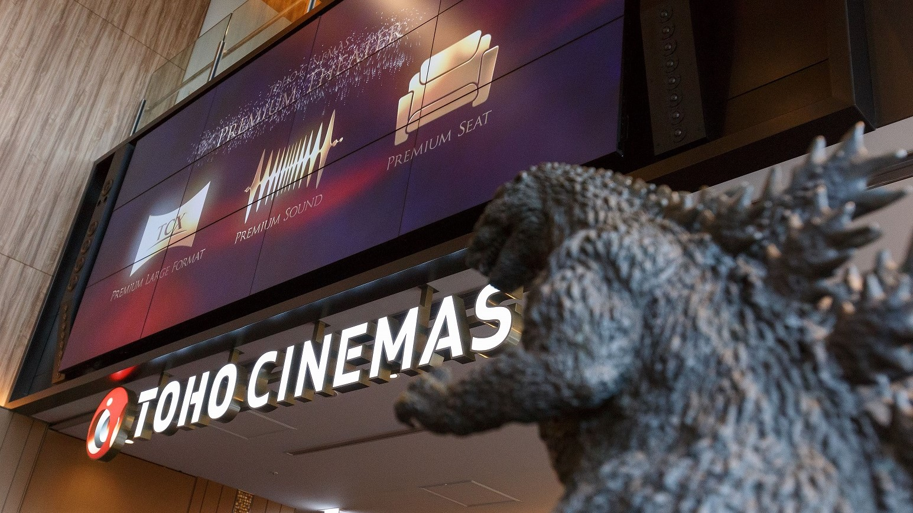
