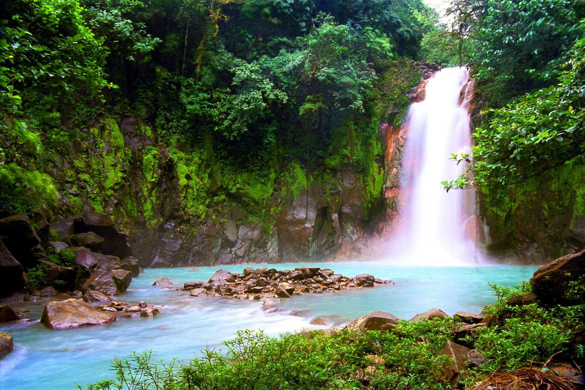

라틴 아메리카에서 잊을 수 없는 모험을 떠날 준비를 하세요! 멋진 풍경, 활기찬 문화, 경이로운 경험을 제공하는 꼭 방문해야 할 5개 국가를 발견하세요.

## 멕시코
고대 마야 유적지, 아름다운 해변, 멕시코시티와 오악사카 같은 다채로운 도시가 있는 멕시코를 탐험하세요. 맛있는 요리에 빠져보고 풍부한 역사에 빠져보세요.

## 브라질
브라질의 에너제틱한 리듬을 느껴보세요! 상징적인 도시인 리우데자네이루와 상파울루를 방문하고 삼바 비트에 맞춰 춤을 추고 웅장한 이과수 폭포를 목격하세요. 카니발의 정신을 받아들이고 황금빛 해변에서 휴식을 취하고 아마존 열대우림을 탐험하세요.

## 아르헨티나
아르헨티나의 열정적인 탱고 문화에 흠뻑 빠져보세요. 국제 도시인 부에노스 아이레스를 발견하고 파타고니아의 숨막히는 풍경에 감탄하고 멋진 이과수 폭포를 방문하십시오. 맛있는 아르헨티나 스테이크와 세계적 수준의 와인을 음미하는 것을 잊지 마세요.

## 페루
전설적인 마추픽추의 고향인 페루로 여행을 떠나보세요. 고대 유적을 탐험하고 그림 같은 신성한 계곡을 하이킹하고 활기찬 도시인 리마를 방문하십시오. 페루 요리로 입맛을 돋우고 상징적인 티티카카 호수에서 보트 여행을 떠나보세요.

## 코스타리카
코스타리카의 열대 우림과 멋진 해안선의 생물 다양성을 경험하십시오. 무성한 캐노피 사이로 집라인을 타고 국립공원에서 이국적인 야생동물을 관찰하고 깨끗한 해변에서 휴식을 취하세요. 아레날 화산을 방문하고 천연 온천에 몸을 담글 기회를 놓치지 마세요.

라틴 아메리카는 잊을 수 없는 경험의 태피스트리를 제공합니다. 이 5개국은 여러분을 기다리고 있는 경이로움의 일부일 뿐입니다. 여행 계획을 시작하고 모험, 문화, 자연의 아름다움으로 가득한 여행을 시작하세요!

