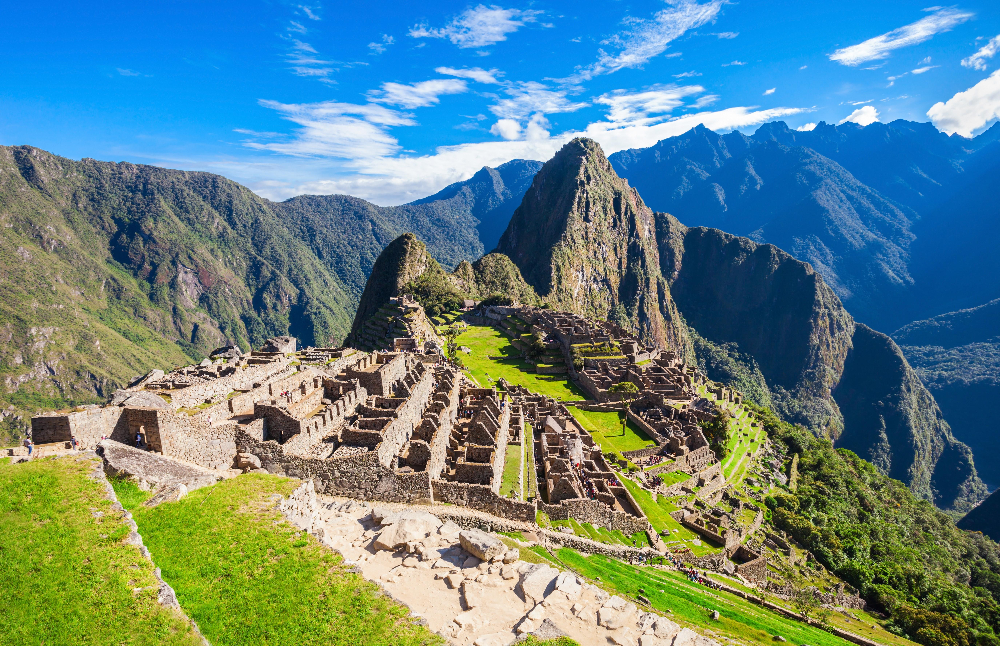
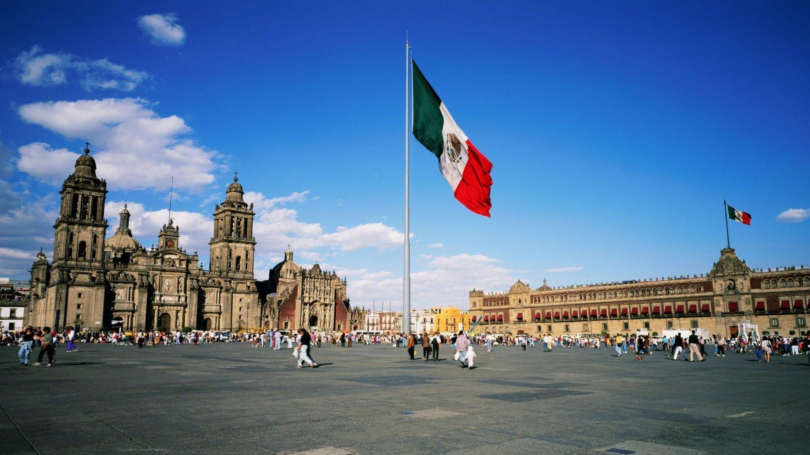
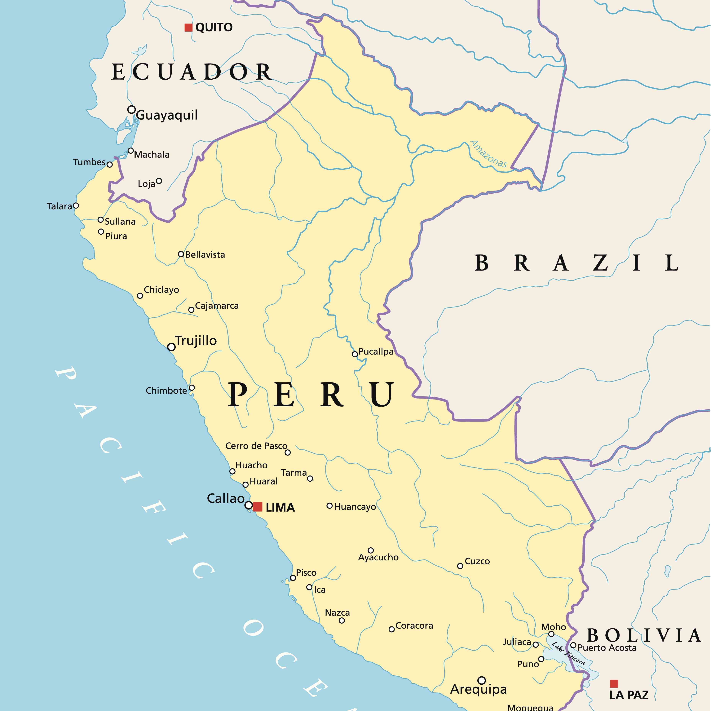
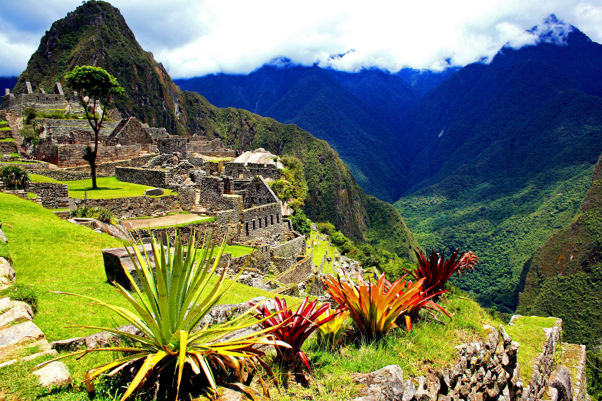
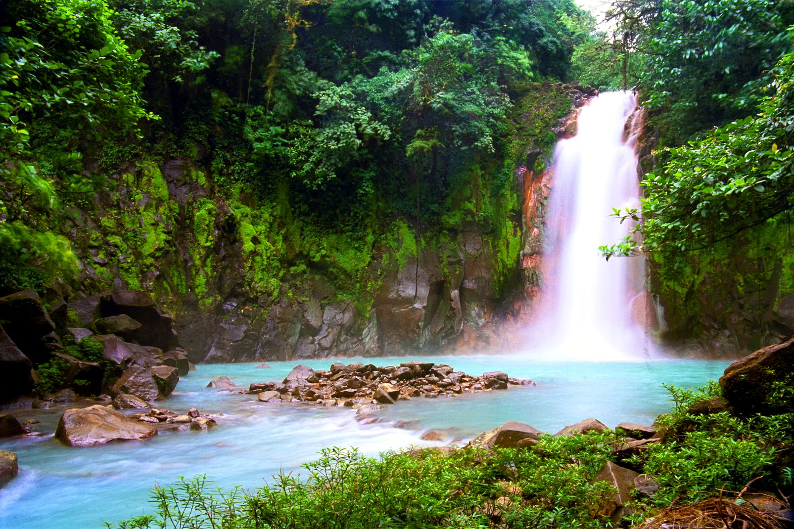
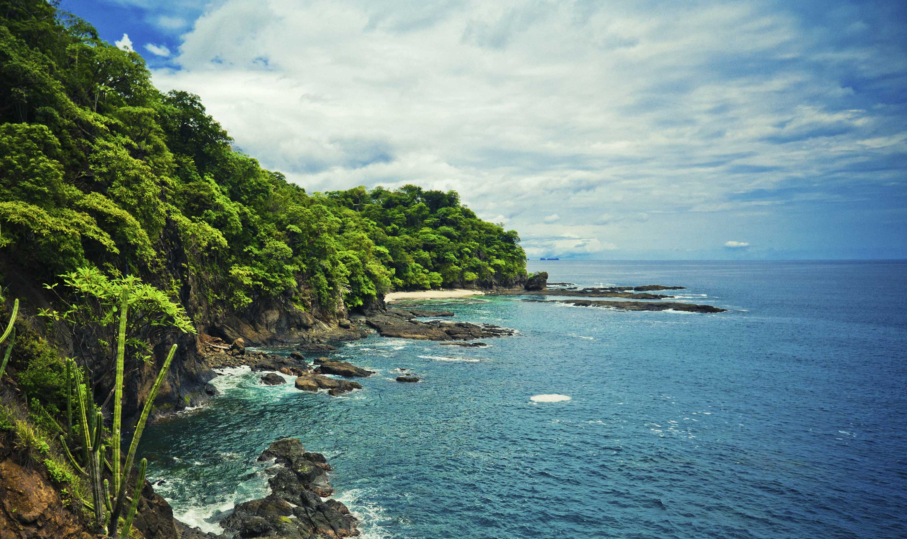

Get ready for an unforgettable adventure in Latin America! Discover five must-visit countries that offer stunning landscapes, vibrant cultures, and phenomenal experiences.

## Mexico
Explore Mexico, home to ancient Mayan ruins, stunning beaches, and colorful cities like Mexico City and Oaxaca. Indulge in delicious cuisine, immerse yourself in rich history and marvel at the breathtaking landscapes of places like Tulum and Chichen Itza.

## Brazil
Experience the energetic rhythm of Brazil! Visit the iconic cities of Rio de Janeiro and Sao Paulo, dance to samba beats, and witness the magnificent Iguazu Falls. Embrace the spirit of carnival, relax on the golden beaches and explore the Amazon rainforest.

## Argentina
Immerse yourself in the passionate tango culture of Argentina. Discover the cosmopolitan city of Buenos Aires, marvel at the breathtaking landscapes of Patagonia, and visit the stunning Iguazu Falls. Don't forget to indulge in delicious Argentinean steak and sip on world-class wines.

## Peru
Embark on a journey to Peru, home of the legendary Machu Picchu. Explore the ancient ruins, hike through the picturesque Sacred Valley, and visit the vibrant city of Lima. Delight your taste buds with Peruvian cuisine and take a boat trip on the iconic Lake Titicaca.

## Costa Rica
Experience the biodiversity of Costa Rica's rainforests and stunning coastlines. Zip-line through the lush canopy, spot exotic wildlife in national parks, and relax on pristine beaches. Don't miss the chance to visit Arenal Volcano and take a dip in the country's natural hot springs.

Latin America offers a tapestry of unforgettable experiences. These five countries are just a glimpse of the wonders that await you. Start planning your trip and embark on a journey filled with adventure, culture, and natural beauty!

