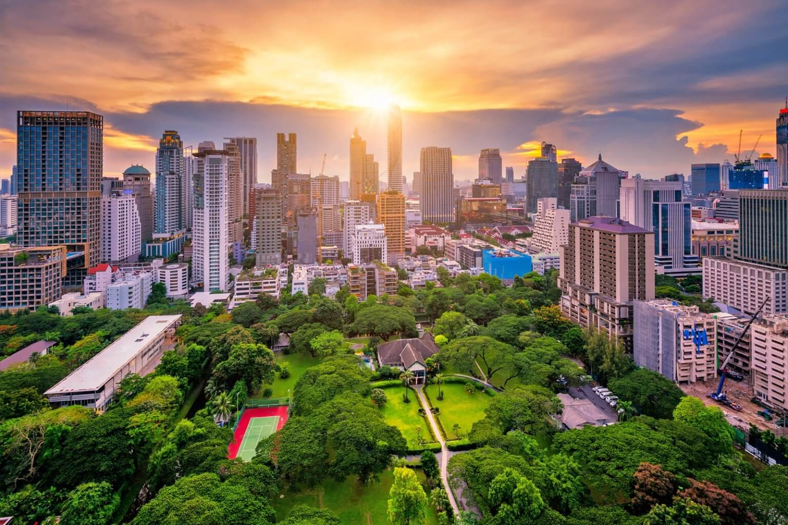
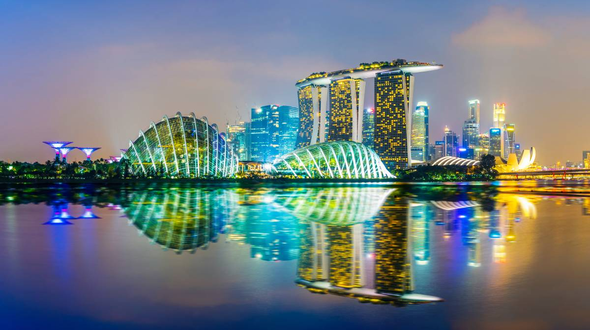
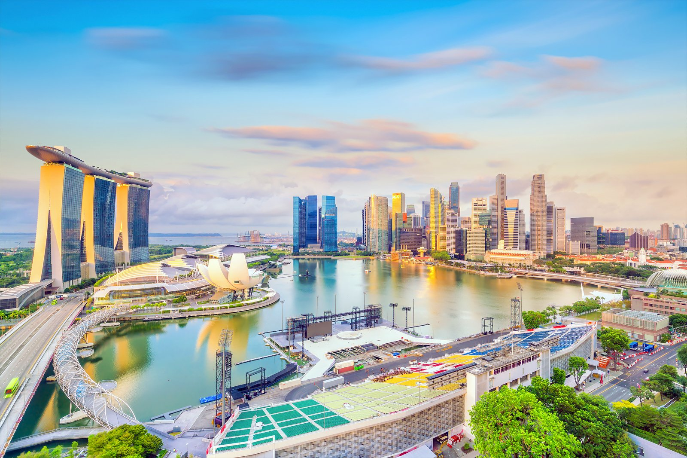
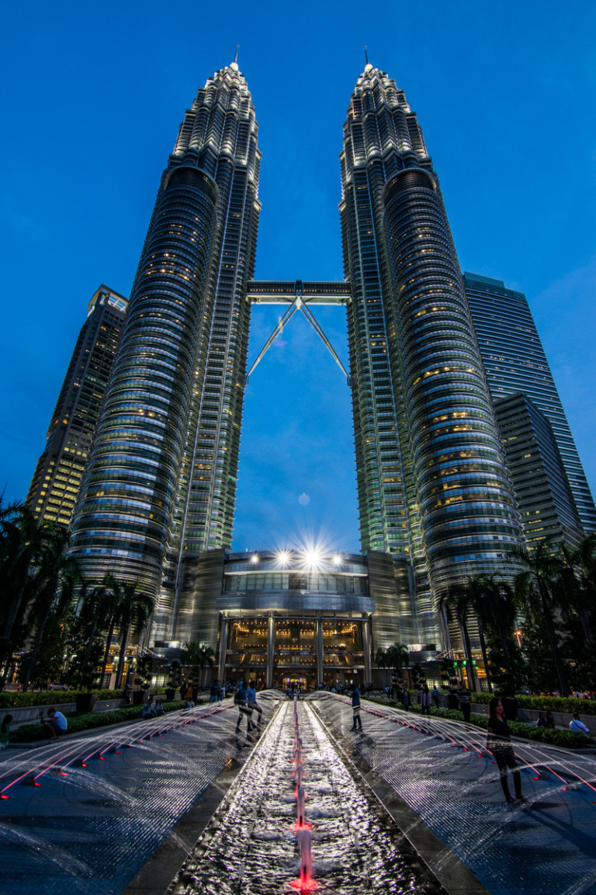
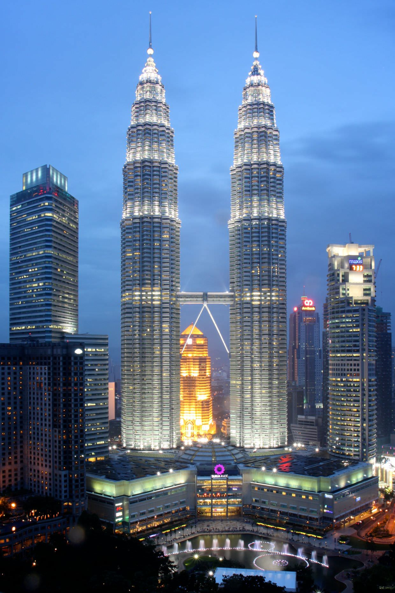
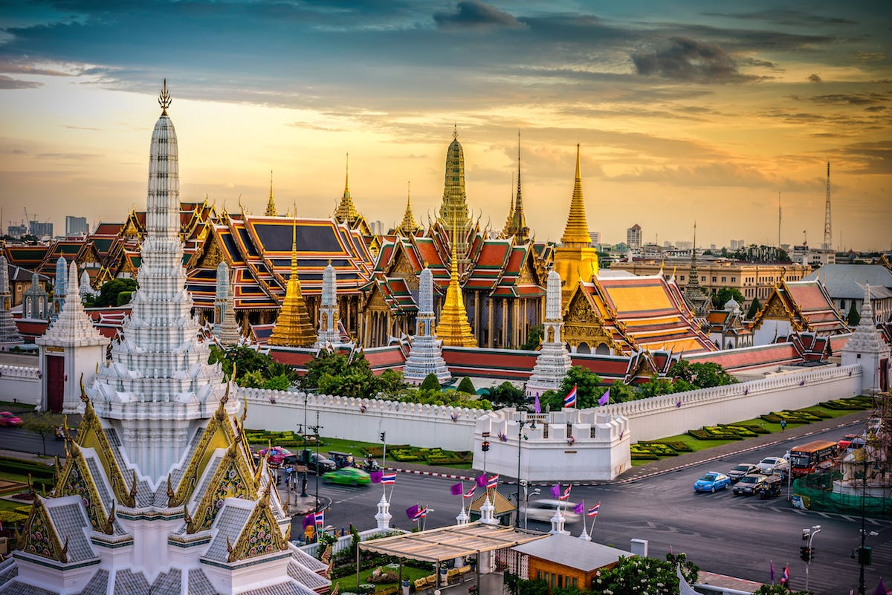
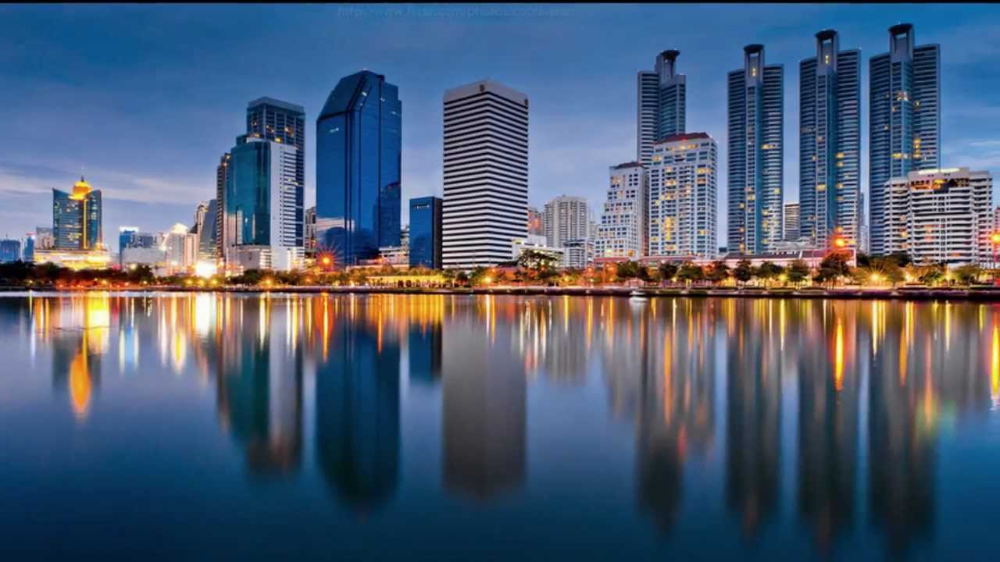

South East Asia boasts a plethora of vibrant cities, but here are the top three cities that stand out as the best places to live in the region.

<!--  -->

## 1. Singapore
With its excellent infrastructure, low crime rates, and booming economy, Singapore consistently ranks as one of the best cities to live in South East Asia. The city-state offers a high standard of living, world-class healthcare, and a clean and safe environment. Additionally, Singapore is known for its multiculturalism, creating a diverse and inclusive society.

## 2. Kuala Lumpur
Kuala Lumpur, the capital of Malaysia, is a melting pot of cultures and a thriving metropolis. It offers a combination of modern amenities and natural beauty, with its iconic Petronas Twin Towers dominating the skyline. Kuala Lumpur provides a great work-life balance, affordable cost of living, and excellent food scene. It also has a well-developed public transportation system, making it easy to navigate the city.

## 3. Bangkok
Known for its bustling street markets, ornate temples, and vibrant nightlife, Bangkok is a city that never sleeps. This vibrant capital of Thailand offers a mix of tradition and modernity, with a wide range of entertainment options and a rich cultural heritage. Bangkok is also known for its affordable cost of living, delicious street food, and welcoming locals.

These three cities, Singapore, Kuala Lumpur, and Bangkok, offer unique experiences and opportunities to residents, making them the top choices for those seeking the best cities to live in South East Asia.

