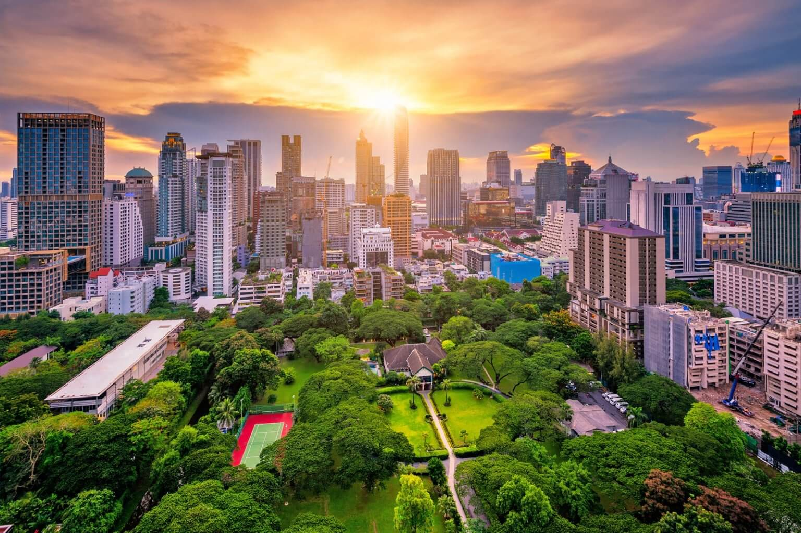
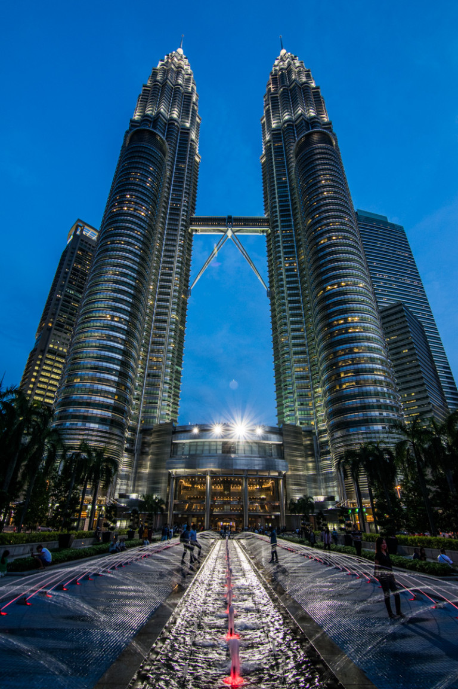

동남아시아는 수많은 활기찬 도시를 자랑하지만, 이 지역에서 가장 살기 좋은 도시로 눈에 띄는 상위 3개 도시를 소개합니다.

<!--  -->

## 1. 싱가포르
우수한 인프라, 낮은 범죄율, 호황을 누리고 있는 경제로 싱가포르는 동남아시아에서 가장 살기 좋은 도시 중 하나로 꾸준히 선정되고 있습니다. 도시 국가는 높은 생활 수준, 세계적 수준의 의료 서비스, 깨끗하고 안전한 환경을 제공합니다. 또한 싱가포르는 다문화주의로 유명하여 다양하고 포용적인 사회를 만듭니다.

## 2. 쿠알라룸푸르
말레이시아의 수도인 쿠알라룸푸르는 문화의 용광로이자 번창하는 대도시입니다. 스카이라인을 지배하는 상징적인 페트로나스 트윈 타워와 함께 현대적인 편의 시설과 자연의 아름다움이 조화를 이루고 있습니다. 쿠알라룸푸르는 훌륭한 일과 삶의 균형, 저렴한 생활비, 훌륭한 음식 환경을 제공합니다. 또한 잘 발달된 대중 교통 시스템을 갖추고 있어 도시를 쉽게 탐색할 수 있습니다.

## 3. 방콕
번화한 거리 시장, 화려한 사원, 활기찬 나이트라이프로 유명한 방콕은 절대 잠들지 않는 도시입니다. 이 활기찬 태국의 수도는 다양한 엔터테인먼트 옵션과 풍부한 문화 유산으로 전통과 현대가 조화를 이루고 있습니다. 방콕은 저렴한 생활비, 맛있는 길거리 음식, 친절한 현지인으로도 유명합니다.

싱가포르, 쿠알라룸푸르, 방콕 세 도시는 주민들에게 독특한 경험과 기회를 제공하여 동남아시아에서 가장 살기 좋은 도시를 찾는 사람들에게 최고의 선택이 되고 있습니다.

