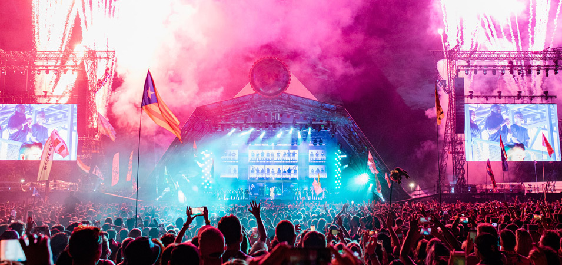
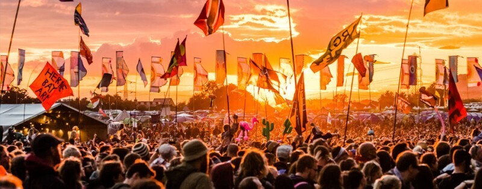
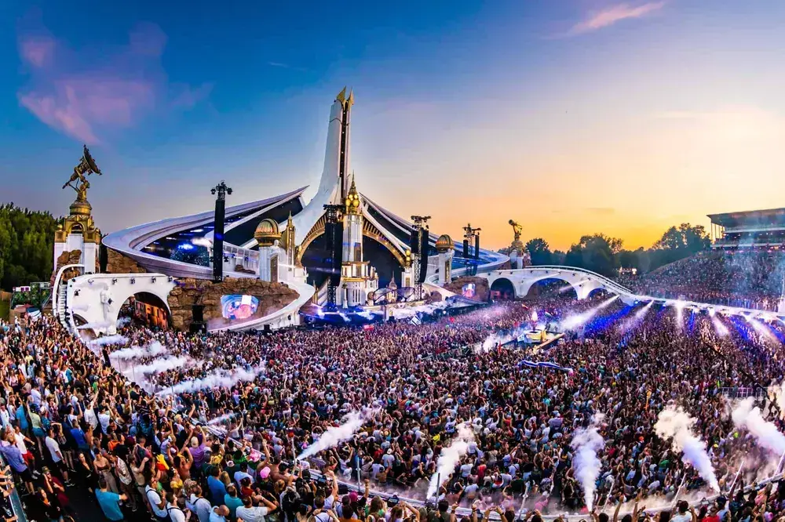
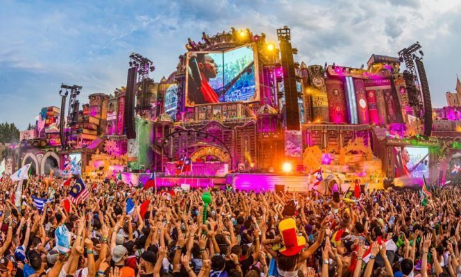

음악축제는 예술, 문화, 음악의 힘의 놀라운 축제입니다. 이 세상을 떠나기 전에 알아야 할 세 가지 아이코닉한 음악축제를 소개합니다.

세계 각지에서 열리는 이 음악축제들은 수많은 인파가 모여 하나의 열정과 음악적 울림을 만들어냅니다. 흥겨운 음악과 열정 넘치는 분위기는 사람들에게 기쁨과 활력을 선사합니다.

## 1. 코첼라

음악축제의 트렌드 세터인 코첼라는 미국 캘리포니아에서 개최됩니다. 유명 아티스트들이 모이는 이 축제는 음악, 예술 설치물, 패션의 독특한 조화를 선보입니다. 잊지 말고 이 놀라운 경험을 즐겨보세요!

## 2. 글래스톤버리

영국에서 개최되는 글래스톤버리는 세계에서 가장 큰 음악축제 중 하나입니다. 다양한 장르의 아티스트들을 대거 초청하여 음악적 조화의 진수를 선보입니다. 음악을 사랑하는 모든 이들에게 꼭 가보길 추천해요!

## 3. 투모로우랜드

세계에서 가장 유명한 일렉트로닉 댄스 음악 축제입니다. 벨기에에서 개최되는 투모로우랜드는 음악 열정가들이 최고의 디제이들의 비트에 맞추어 춤을 추는 환상적인 세계를 만들어냅니다. 그 마법을 직접 경험해 보세요.

세계적인 음악 축제에 참여해서 음악과 문화 세계를 경험하고 남길 수 있는 음악축제를 꼭 가보시길 바랍니다. 음악을 통해 즐거움과 연결됨을 느끼며, 아이코닉한 순간들을 만들어보세요.