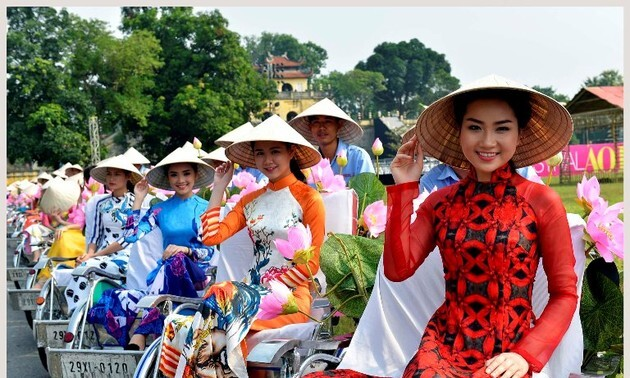
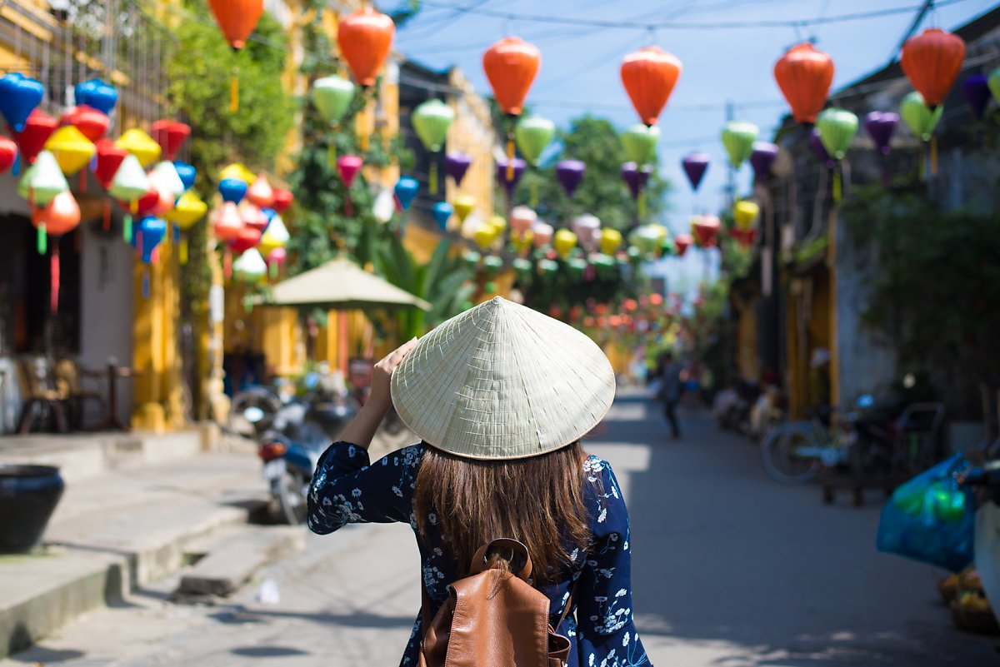
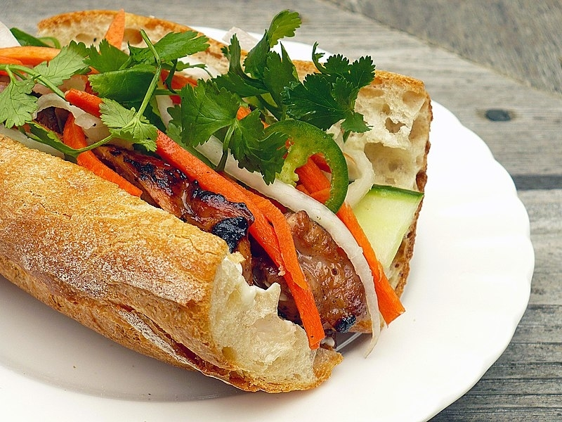
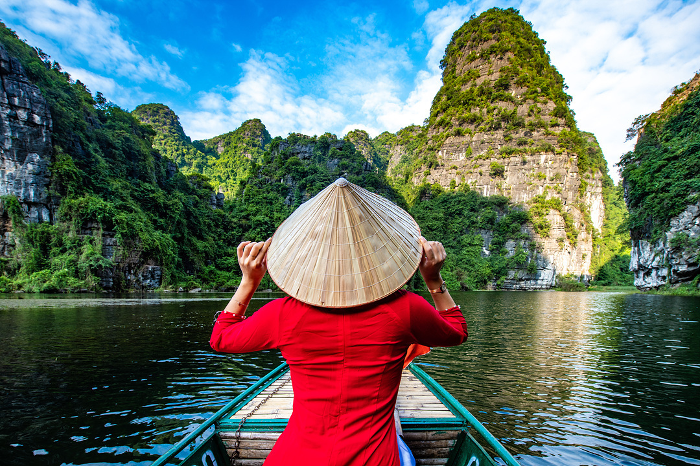
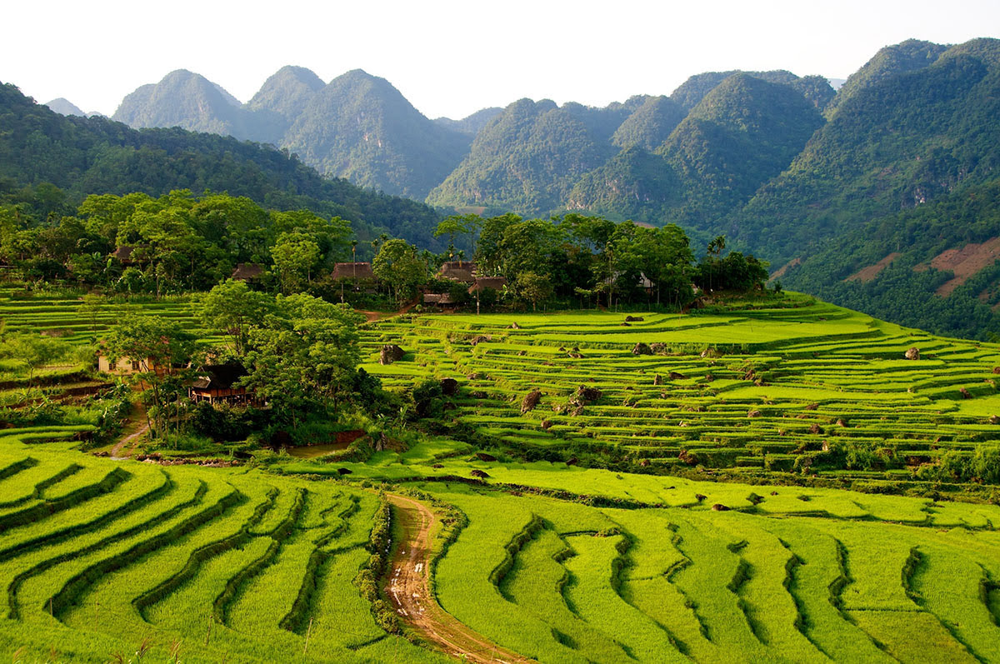
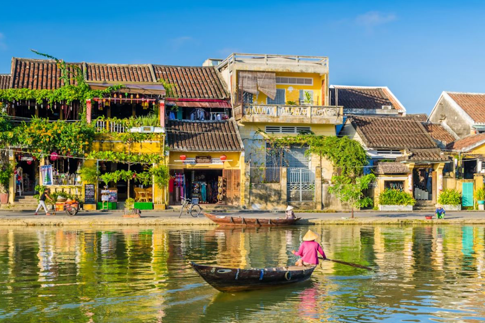
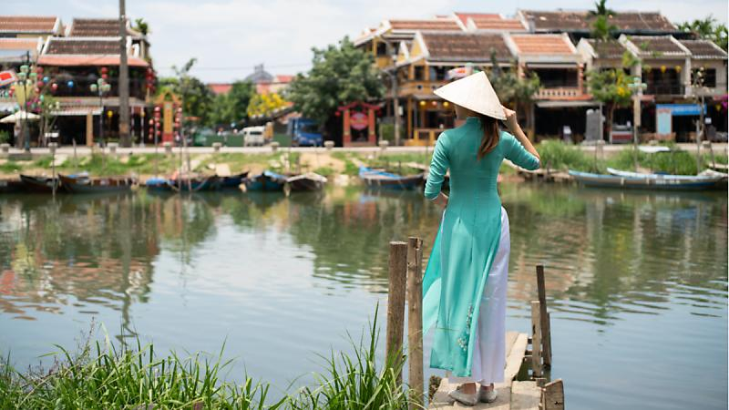

베트남은 황홀한 자연 경관, 풍부한 역사와 문화, 맛있는 음식, 그리고 친절한 사람들과의 만남으로 가득한 매력적인 여행지입니다. 이러한 베트남을 여행하기 전에 알아야 할 3가지 중요한 사항이 있습니다.

## 1. 베트남 문화 예절
베트남을 여행할 때는 숙습을 지켜야 합니다. 웃으며 가볍게 인사하며 '신자오'라고 말하고 '침 언'이라고 감사인사를 말합니다. 신사를 방문할 때는 겸손하게 옷을 입고, 집에 들어갈 때는 신발을 벗어야 합니다.

## 2. 베트남 요리
베트남 요리는 그 맛으로 세계적으로 유명합니다. 유명한 '포'라고 불리는 육수 면 요리나 다양한 재료가 들어 있는 맛있는 파이 프랑스식 샌드위치 '반미'를 놓치지 마세요. 현지의 길거리 음식 시장에서 식도락의 모험을 즐겨보세요!

## 3. 베트남 자연
베트남은 다양한 자연 경관으로 유명합니다. 호아안 섬이나 황제의 정원으로 알려진 황염 구릉지 등 아름다운 풍경을 탐험해보세요. 베트남의 자연에서의 여행은 흥미 진진한 경험을 선사합니다.

그럼 이제, 풍부한 문화에 빠져들고, 맛있는 요리를 맛보고, 숨막히는 풍경에 잠겨보세요. 베트남 사람들의 따뜻한 거점을 이해하고 잊을 수 없는 추억을 만들기를 잊지 마세요. 베트남 커피 한 잔을 마실 때, 이 귀한 나라에서의 여정의 완벽한 마무리를 지으세요.

